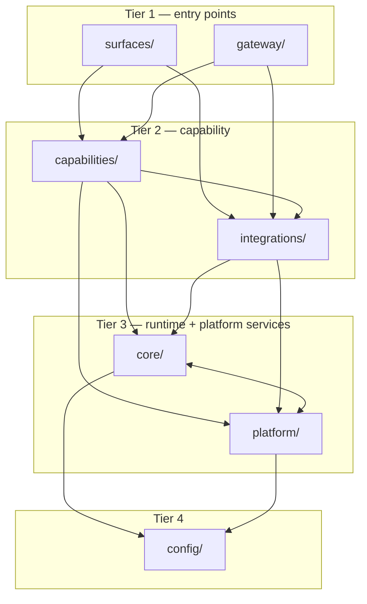
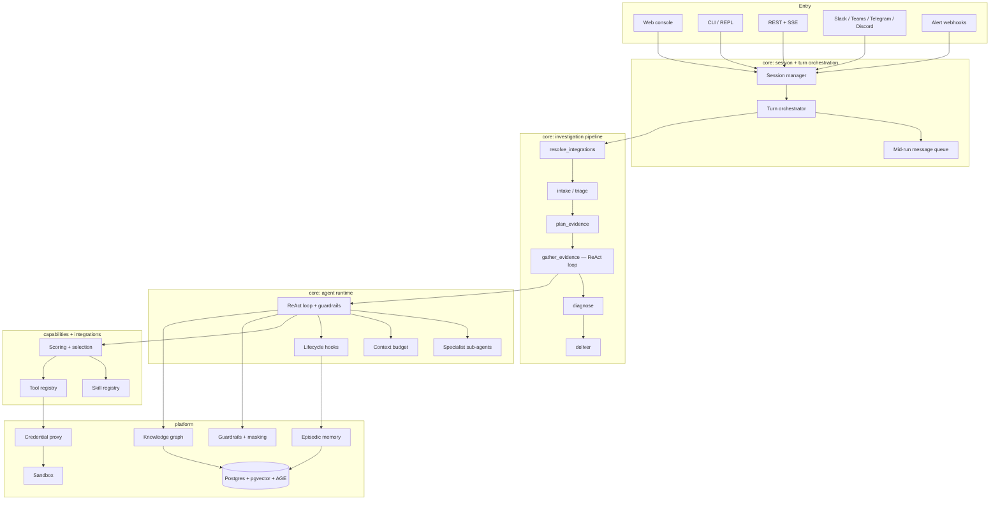
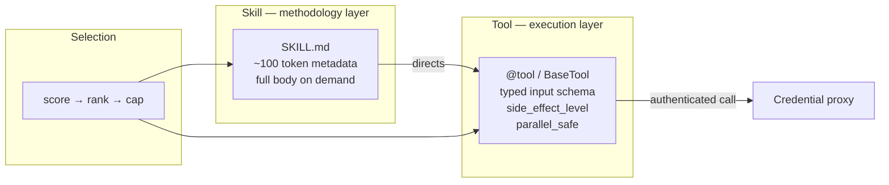
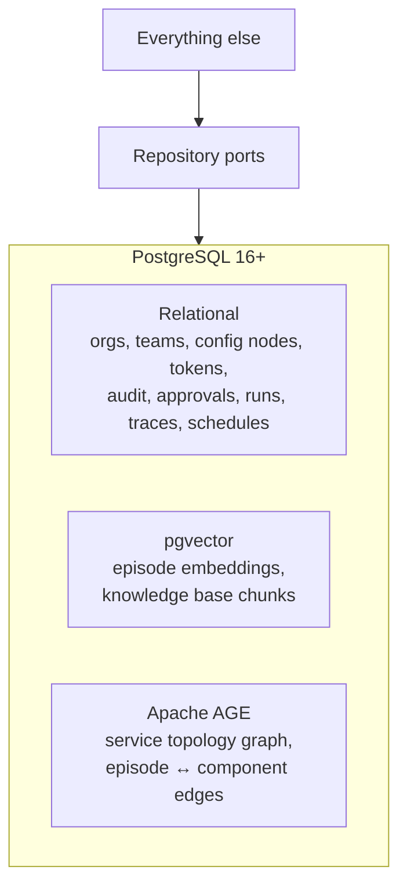
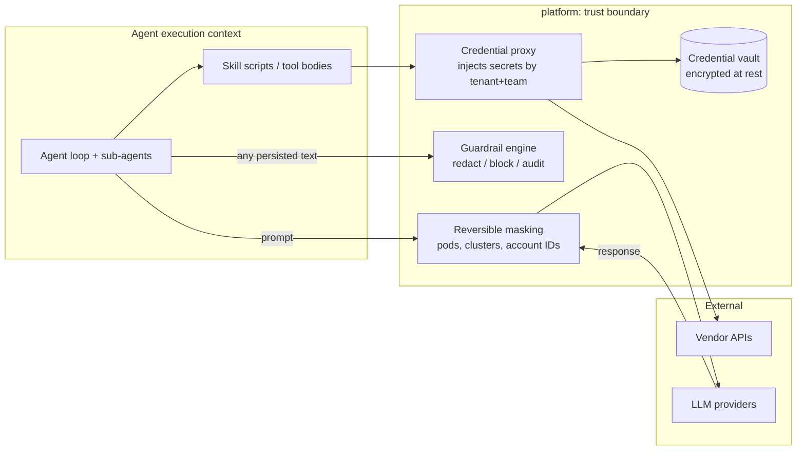
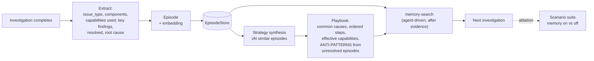
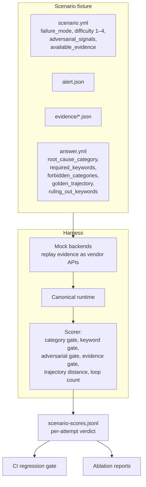

# NinjaSRE — Target Architecture

This is the architecture every `plan.md` must fit into. Deviations require a
Complexity Tracking entry and, if structural, an ADR.

---

## 1. Package tiers

Dependencies point downward only. Enforced by `import-linter` in CI
(Constitution Article VIII).

| Tier | Packages | May import | Must never import | Peer rule |
|---|---|---|---|---|
| 1 | `surfaces/`, `gateway/` | `capabilities`, `integrations`, `core`, `platform`, `config` | — | Must not import each other |
| 2 | `capabilities/` | `integrations`, `core`, `platform`, `config` | `surfaces`, `gateway` | May use integration clients |
| 2 | `integrations/` | `core`, `platform`, `config` | `capabilities`, `surfaces`, `gateway` | Stays reusable below the agent layer |
| 3 | `core/`, `platform/` | `config` | tiers 1–2 | Siblings; may cross-import |
| 4 | `config/` | — | everything | Leaf |



### Package responsibilities

| Package | Owns |
|---|---|
| `config/` | Env var names, shared constants, prompt constants, theme. Imports nothing first-party. |
| `core/` | Agent runtime (ReAct loop, sub-agents, guardrails, context budget), investigation pipeline, state and evidence model, LLM provider abstraction, capability framework primitives, pure domain rules. |
| `platform/` | Cross-cutting services with no investigation logic: persistence, credential vault and proxy, guardrails engine, masking, sandbox, memory stores, knowledge graph, scheduler, notifications, auth, observability, reporting delivery. |
| `integrations/` | Per-vendor config normalisation, credential schema, verifier, API client. One package per vendor. Never imports `capabilities`. |
| `capabilities/` | Agent-callable surface: typed tools, skills, registry, discovery, scoring, selection. |
| `gateway/` | Inbound transports: chat platforms, webhook ingestion, REST/SSE server. |
| `surfaces/` | Human-facing clients: CLI, REPL, web console backend-for-frontend. |

---

## 2. Runtime architecture



### The investigation pipeline

Six stages, each a pure function `(state) -> updates` merged into a shared
`AgentState`. A stage exception is recorded and re-raised; failures are never
silently swallowed.

| Stage | Responsibility | Exit condition |
|---|---|---|
| `resolve_integrations` | Determine which vendor integrations this team has connected and credentialed | Universe of available capabilities established |
| `intake` | One LLM call classifies the input: noise short-circuits with zero tool calls; a real alert yields structured fields and a computed incident window | `is_noise=true` stops the pipeline |
| `plan_evidence` | Score every available capability against the alert; keep the top `tool_budget` as `planned_actions` with a written rationale | Advisory plan produced |
| `gather_evidence` | The bounded ReAct loop. Seed calls fire first; then think → select → execute → observe under all guardrails | Conclusion accepted, or bound reached |
| `diagnose` | Structured-output LLM call parses the free-text conclusion into `root_cause`, `root_cause_category`, `causal_chain`, `validated_claims`, `non_validated_claims`, `remediation_steps`, `validity_score` | Structured diagnosis produced |
| `deliver` | Format and ship to configured destinations; persist the trace; fire the memory lifecycle hook | Report delivered, episode written |

### The ReAct loop and its guardrails

All bounds are named constants in `config/constants/investigation.py`
(Constitution Article II).

| Guardrail | Constant | Purpose |
|---|---|---|
| Tool schema cap | `MAX_AGENT_TOOL_SCHEMAS` | Bounds per-turn schema payload regardless of catalogue size |
| Secondary reserve | `MAX_SECONDARY_FALLBACK_TOOLS` | Guarantees cheap reasoning/knowledge capabilities survive the cap |
| Loop ceiling | `MAX_INVESTIGATION_LOOPS` | Worst-case runtime bound |
| Stagnation breaker | `MAX_STAGNANT_ITERATIONS` | After N duplicate-only iterations, strip tool access and force a text conclusion |
| Context budget | `context_budget_ceiling_for_model()` | Evict/truncate lowest-value evidence before the model's limit |
| Plan size | `tool_budget` | Shortlist handed to the loop before it starts |
| Sub-agent depth | `MAX_SUBAGENT_DEPTH` | Prevents recursive sub-agent explosion |
| Parallel fan-out | `MAX_PARALLEL_TOOL_CALLS` | Bounds concurrent execution |

Additional loop mechanics:

- **Seed calls** — deterministic, obviously-needed capability invocations execute
  before the model's first turn, so the loop starts with free evidence.
- **Duplicate cache** — identical name + args is served from cache and the model
  is told explicitly it already has that result.
- **Degradation** — an LLM invoke failure produces a partial investigation state
  preserving gathered evidence, never a crash.

### Sub-agents

Specialist sub-agents run as isolated sub-loops with their own context window,
capability subset, and budget. They return a structured finding to the parent
rather than a transcript.

| Sub-agent | Scope |
|---|---|
| `log-analyst` | Log statistics, pattern extraction, strategic sampling |
| `metrics-analyst` | Time-series correlation, anomaly windows, change points |
| `k8s-debugger` | Events-before-logs Kubernetes triage |
| `cloud-inspector` | Cloud control-plane state and recent changes |
| `code-historian` | Deploys, diffs, and change correlation |
| `memory-recaller` | Episodic recall and strategy retrieval |

### Runtime port

The canonical runtime is the first-party loop. `core/agent/runtime_port.py`
defines the contract; an experimental `ClaudeAgentSdkRuntime` adapter may
implement it. Per Constitution Article V the adapter is never default and never
produces benchmark numbers.

---

## 3. Capability model

Two layers, one catalogue.



- A **skill** carries investigation methodology for a domain: what to check
  first, what order, what anti-patterns to avoid, what query syntax looks like.
  Its metadata costs ~100 tokens; the body loads only when selected.
- A **tool** is typed execution with a JSON Schema input, declared evidence
  source, `side_effect_level`, `parallel_safe` flag, and approval requirements.
- A skill **declares the tools it directs**. Skills do not execute arbitrary shell
  against production (Constitution Article IX).
- Both are auto-discovered from their owning packages. No central registry file.

### Capability metadata (required fields)

```
name, display_name, description, input_schema, output_schema,
evidence_source, evidence_type, side_effect_level, parallel_safe,
requires (credentials/integrations), requires_approval, approval_reason,
use_cases, examples, anti_examples, retrieval_controls, tags
```

---

## 4. Data architecture

One PostgreSQL instance with `pgvector` and Apache AGE (Constitution Article XI).



### Repository ports

| Port | Backs |
|---|---|
| `ConfigRepository` | Hierarchical org → team config nodes, effective-config computation |
| `IdentityRepository` | Users, teams, tokens, roles, SSO bindings |
| `AuditRepository` | Immutable audit events |
| `RunTraceStore` | Agent runs, turns, tool calls, evidence, transcripts |
| `EpisodeStore` | Episodic memory CRUD + lifecycle |
| `VectorIndex` | Embedding upsert and similarity search |
| `TopologyGraph` | Service nodes, dependency edges, blast-radius traversal |
| `KnowledgeStore` | Runbooks, hierarchical knowledge tree, proposed changes |
| `ApprovalStore` | Pending changes, remediation approvals, rollback plans |
| `ScheduleStore` | Recurring jobs and claims |

No module outside `platform/persistence/` issues SQL or Cypher directly.

---

## 5. Trust boundary



Invariants (Constitution Article IV):

1. The agent context never holds a credential — not in env, prompt, args, disk,
   or trace.
2. Authenticated calls carry a tenant/team-scoped handle; the proxy resolves and
   injects the real secret at the network edge.
3. Identifiers are masked before leaving for an external LLM and unmasked only
   when rendering to an authorised human.
4. Every persisted or transmitted string passes the guardrail engine.

### Sandbox profiles

| Profile | Isolation | Target |
|---|---|---|
| `process` | OS process with resource limits, no network egress except via proxy | Local development |
| `container` | Per-investigation container, egress via proxy only | Default self-hosted |
| `kubernetes` | Pod per thread with Envoy sidecar enforcing egress allow-list, warm pool, TTL, JWT injection | Multi-tenant / regulated |

The credential proxy is mandatory in all three.

---

## 6. Memory and learning architecture



Rules (Constitution Article VII):

- Recall is **agent-driven**: retrieved after concrete evidence exists, never
  pre-injected on a vague alert.
- `resolved` means *a root cause was established with evidence*. It does not mean
  production was fixed.
- `effectiveness_score` weights how strongly an episode should influence future
  investigations.
- Strategy synthesis derives **anti-patterns** from unresolved and low-effectiveness
  episodes — what did not work is as valuable as what did.
- Every mechanism ships with an ablation switch so the evaluation suite can
  isolate its contribution.

---

## 7. Evaluation architecture



Scoring axes:

| Axis | Measures |
|---|---|
| **Accuracy** | Root-cause category matches; required keywords present; forbidden categories absent |
| **Evidence** | Required evidence sources were actually collected |
| **Adversarial resistance** | `ruling_out_keywords` present — proof the agent explicitly dismissed the planted red herrings |
| **Trajectory efficiency** | Distance from `golden_trajectory` (strict / LCS / set matching), extra actions, redundant calls, loop count vs `max_investigation_loops` |
| **Cost** | Tokens and wall-clock per scenario |

Test catalogue:

| Suite | Nature |
|---|---|
| `tests/synthetic/` | Deterministic fixtures with answer keys, mock backends, difficulty curriculum |
| `tests/chaos/` | Real fault injection via Chaos Mesh against a live cluster |
| `tests/e2e/` | Cloud-backed scenarios (K8s, EC2, CloudWatch, Lambda, ECS, otel-demo with flagd fault injection) |
| `tests/benchmarks/` | External benchmark adapters (Cloud-OpsBench), model comparison runs |

---

## 8. Deployment profiles

| Profile | Components | Use |
|---|---|---|
| `dev` | Single process + Postgres | Local development |
| `standard` | Compose: agent, web console, Postgres, credential proxy | Default self-hosted team deployment |
| `enterprise` | Helm chart: agent replicas, sandbox pods + Envoy, Postgres HA, OTel collector, SSO | Regulated / multi-tenant |

No profile requires an external network dependency to function
(Constitution Article X).

---

## 9. Repository layout

```
ninjasre/
├── config/                      # Tier 4 — constants, env names, prompts
│   ├── constants/
│   └── prompts/
├── core/                        # Tier 3 — runtime
│   ├── agent/                   #   ReAct loop, sub-agents, runtime port, guardrail hooks
│   ├── pipeline/                #   six investigation stages
│   ├── state/                   #   AgentState, evidence, slices
│   ├── llm/                     #   provider abstraction, transports, schema normalisation
│   ├── capability/              #   tool + skill framework primitives
│   └── domain/                  #   pure rules: alerts, correlation, diagnosis taxonomy
├── platform/                    # Tier 3 — cross-cutting services
│   ├── persistence/             #   ports + Postgres/pgvector/AGE implementations
│   ├── credentials/             #   vault + proxy
│   ├── guardrails/
│   ├── masking/
│   ├── memory/                  #   episodes, retrieval, strategy synthesis
│   ├── knowledge/               #   topology graph, knowledge base
│   ├── sandbox/
│   ├── identity/                #   auth, RBAC, SSO, audit
│   ├── approvals/
│   ├── scheduler/
│   ├── notifications/
│   ├── reporting/
│   └── observability/
├── integrations/                # Tier 2 — one package per vendor
│   └── <vendor>/{config,verifier,client}.py
├── capabilities/                # Tier 2 — agent-callable
│   ├── registry/
│   ├── skills/<skill-id>/SKILL.md
│   └── tools/<domain>/
├── gateway/                     # Tier 1 — inbound transports
│   ├── http/                    #   REST + SSE
│   ├── webhooks/                #   alert ingestion
│   ├── slack/ teams/ telegram/ discord/
├── surfaces/                    # Tier 1 — human clients
│   ├── cli/
│   ├── repl/
│   └── console/                 #   Next.js web console
├── tests/
│   ├── synthetic/ chaos/ e2e/ benchmarks/ contract/ unit/
├── deploy/
│   ├── compose/ helm/
├── docs/
└── specs/
```
