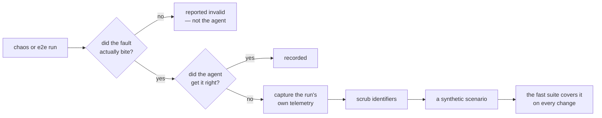

# The chaos and end-to-end suites

The synthetic corpus proves the agent reasons correctly over evidence somebody
recorded. These suites prove it against **real infrastructure failing for real
reasons** — which is a different claim, because recorded evidence can only
contain failure modes somebody thought to record.

They are not a pull-request gate. They run before a release and on a schedule,
and their most valuable output is not a number: it is a *captured scenario*, so
that every failure they find becomes a permanent test on the cheap path.



## Getting a cluster

```bash
make chaos-setup        # local, free, runs every experiment
make chaos-teardown
```

`make chaos-setup-eks` and `make chaos-teardown-eks` do the same against a
managed control plane, for the experiments whose behaviour differs there. That
one costs money and refuses to start without `NINJASRE_E2E_CLOUD=1`.

Without a cluster, every one of these suites **skips with a message naming what
is missing and the command that fixes it**. It never fails the gate, because a
suite that went red on every laptop is one people delete.

## The chaos suite

Fourteen experiments, one per fault: pod kill, container kill, CPU and memory
stress, IO latency, network delay, partition, corruption, bandwidth limiting,
DNS failure and random resolution, and HTTP abort, delay, and response fault.

Each is a directory under `tests/chaos/experiments/` holding three files:

| File | What it is |
|---|---|
| `chaos.yaml` | The declarative fault, in the chaos framework's own form |
| `alert.json` | The alert the fault raises, in the vendor's webhook shape |
| `expected.yml` | What the experiment says it will produce, **before it runs** |

```bash
make chaos-list                                    # needs no cluster
make chaos-run INVESTIGATOR=your.deployment:build  # the full cycle
make chaos-sweep                                   # after a run that was killed
```

### `expected.yml` and why the validity probe is the important field

```yaml
experiment_id: dns-error
injected_fault: dns_resolution_failure
expected_symptom: [service_unreachable, connection_timeout_errors]
expected_root_cause_category: network_failure
required_keywords: [dns, resolution, name]
validity_probe:
  check: dns_lookup_fails_from_pod
  timeout_seconds: 60
```

Without the probe, "the agent named the wrong cause" and "the injection never
took effect" produce the same failed score. A suite whose failures cannot be
attributed is one nobody acts on, and then one nobody runs. So every run carries
a validity, and there are three of them rather than two:

- **valid** — the declared symptom was observed; the score is a measurement.
- **invalid** — the fault demonstrably did not produce it; the run is
  reported, and **not** counted as an agent failure.
- **unknown** — the probe itself could not be read. Neither of the above:
  calling it invalid would retire a working experiment, and calling it valid
  would score the agent against telemetry nobody confirmed.

### What happens when a run is interrupted

Three exits, three mechanisms.

| How the run ended | What removes the fault |
|---|---|
| Normally, or by raising | The ledger's `finally` |
| By `SIGINT` or `SIGTERM` | A handler that cleans up, then raises `RunInterrupted` |
| By `SIGKILL`, or a lost machine | `make chaos-sweep`, by label |

The third is why every resource the suite applies carries
`app.kubernetes.io/managed-by=ninjasre-chaos`, and why the preflight check
refuses to start on top of a fault that is already active.

## The otel-demo suite

A microservice application with its own observability stack, broken through its
own feature flags. Five faults: cart, product catalogue, recommendation cache,
ad, and payment.

```bash
make e2e-demo-setup
make e2e-demo INVESTIGATOR=your.deployment:build
make e2e-demo-teardown
```

The flag is put back on every way out of the run — including the raising one,
because a flag left on outlives the run and the next one then investigates a demo
that was already broken.

## The cloud suite

Six managed services — EKS, EC2, CloudWatch, Lambda, ECS, RDS — provisioned,
broken, investigated, and destroyed.

```bash
make e2e-cloud INVESTIGATOR=your.deployment:build
make e2e-reap                # report what a killed run left behind
make e2e-reap DESTROY=1      # and then remove it
```

Everything is tagged with the suite, the run, the scenario, and when it was
made. The tags are not tidiness: they are how a resource whose run is gone gets
found and attributed. A resource carrying the suite tag but **no run tag** is
reported and left alone — the sweep cannot tell it from a live run's, and
guessing in an account that holds something else is unrecoverable.

Every scenario declares what one run of it may cost, and the actual is reported
against that. A bound nobody compares against is a comment.

## Turning a real failure into a permanent test

This is the point of running expensive suites.

1. A run scores as an **agent failure** — valid experiment, wrong answer.
2. `tests/e2e/capture.py` writes the run's own telemetry out as a scenario
   directory: the fixtures the vendors actually returned, the alert that
   actually fired, the recorded model transcript, and a drafted answer key.
3. Everything is scrubbed through **one** masking mapping, so the URL a matcher
   holds, the argument a recorded turn passes, and the body a vendor returned
   all still agree — the scrubbed scenario runs, and runs the same way.
4. `verify_scrubbed()` re-scans the directory before it is committed. A file in
   version control is not un-committed by deleting it later.
5. A human reviews the draft. The answer key is marked `REVIEW` on every line
   they still have to decide, and the difficulty is drafted at level 1 —
   not because a captured miss is easy, but because every level above that
   *means* "at least one planted confounder", and a real run's noise was not
   planted.

The captured scenario then runs on the fast path, offline, on every change.

## Scoring

Real runs are scored on the evaluation harness's five axes, by its own code.
There is
no second scorer: a chaos run scored by different arithmetic from a synthetic one
would produce two numbers that look comparable and are not.

Two things are added on top.

**Only valid runs are scored.** An invalid one is reported beside the score, and
the report keeps the two failures apart in words — "the agent was wrong about a
fault that genuinely happened" is a different sentence from "the experiment
failed, not the agent".

**Comparison narrows to what both releases scored.** An experiment that misfired
this release is absent from one side for a reason that is not a corpus change,
so `comparable_pairs` narrows both sides to their intersection and
`not_comparable` names what it dropped. The corpus version is computed over what
was *attempted*, so a misfire does not read as a corpus edit.

## What runs where

| Path | What runs |
|---|---|
| Every pull request (`make verify`) | Every declaration loads; the framework, the validity gate, cleanup, the reaper, and capture are all asserted against recorded doubles. The suites themselves skip. |
| Scheduled (`chaos.yml`) | A cluster is created, the framework and catalogue are exercised against it, and the account is swept for orphans. |
| Before a release | `make chaos-run`, `make e2e-demo`, `make e2e-cloud`, with a composed investigator. |

## Composing an investigator

`INVESTIGATOR=module:factory` names a callable in your own deployment that
returns an object with `investigate(alert, *, team, run_id)`. The suite does not
compose one, and that is deliberate: an investigation needs a provider and the
credential proxy, and a suite that guessed at those would run against whatever
ambient configuration happened to be lying around — which is the failure the
credential design exists to prevent.

`tests/harness/investigator.py`'s `PipelineInvestigator` is the composition to
build on. It takes the model client and the proxy transport and nothing else;
point the transport at a live proxy and it runs against production telemetry,
point it at the harness's in-process one and the same code runs against recorded
responses. That is what makes "the suites use the real integrations" a property
rather than a claim.
