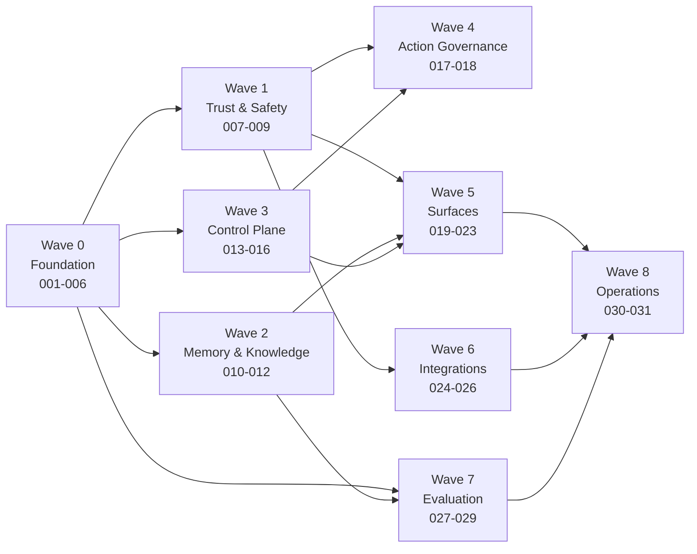

# NinjaSRE MVP Roadmap

The MVP is **the best of both prior systems, complete**. It is delivered as 31
numbered features across 8 waves. Every feature has `specs/<NNN-name>/spec.md`,
`plan.md`, and `tasks.md`.

A wave is a dependency boundary, not a release. Features inside a wave may run in
parallel; a wave may not start until its predecessors' contracts are stable.

---

## Dependency overview

---

## Wave 0 — Foundation

Everything else compiles against these contracts. Nothing here is optional.

| # | Feature | Delivers |
|---|---|---|
| **001** | `platform-foundation` | Repo skeleton, four-tier package layout, `import-linter` boundaries enforced in CI, toolchain (`uv`/`ruff`/`mypy`/`pytest`), config tier, provenance headers, `NOTICE` |
| **002** | `llm-provider-layer` | Provider abstraction across 9 providers with full parity: tool calling, structured output, streaming, retry, token accounting, schema normalisation, prompt caching, failure classification |
| **003** | `capability-framework` | Unified catalogue: typed tools (`@tool`/`BaseTool` + metadata) and skills (`SKILL.md` + progressive disclosure), auto-discovery, scoring, bounded selection, skill↔tool binding |
| **004** | `agent-runtime` | Canonical ReAct loop with all guardrails, specialist sub-agents, parallel execution, mid-run message queue, lifecycle hooks, context budget, runtime port + experimental SDK adapter |
| **005** | `investigation-pipeline` | Six stages, `AgentState`/evidence model, noise triage, capability planning, structured diagnosis, streaming event protocol |
| **006** | `data-platform` | PostgreSQL + `pgvector` + Apache AGE, all repository ports, migrations, encrypted columns, transaction/session management |

**Wave 0 exit criteria:** an investigation runs end-to-end against mock backends on
every supported provider, with all guardrails active and the full trace persisted.

---

## Wave 1 — Trust & Safety

Constitutional invariants. No surface ships before these.

| # | Feature | Delivers |
|---|---|---|
| **007** | `credential-vault-and-proxy` | Encrypted vault, tenant/team-scoped credential resolution, mandatory egress proxy, integration client base that can never see a secret |
| **008** | `guardrails-and-masking` | YAML guardrail rules (redact/block/audit), scan engine with span merging, reversible identifier masking around external LLM calls, audit trail |
| **009** | `sandbox-profiles` | Three isolation profiles (`process`, `container`, `kubernetes` with Envoy egress control, warm pool, TTL, JWT injection) behind one port |

**Wave 1 exit criteria:** a red-team test proves no credential is reachable from
the agent context, and no unmasked identifier reaches an external provider.

---

## Wave 2 — Memory & Knowledge

The learning half of the thesis.

| # | Feature | Delivers |
|---|---|---|
| **010** | `episodic-memory` | Episode model, post-turn extraction, embeddings, similarity retrieval, agent-driven recall via the `memory-search` capability, effectiveness scoring |
| **011** | `strategy-synthesis` | Playbook generation from ≥N similar episodes with anti-patterns mined from unresolved runs, cached strategies, invalidation |
| **012** | `knowledge-graph-and-base` | Service topology in Apache AGE (dependencies, blast radius), hierarchical knowledge base with runbooks, ingestion, proposed-change review |

**Wave 2 exit criteria:** memory and topology are queryable by the agent, and each
mechanism has a working ablation switch.

---

## Wave 3 — Control Plane

Multi-tenancy, identity, governance of configuration.

| # | Feature | Delivers |
|---|---|---|
| **013** | `hierarchical-config-service` | Org → team tree, deep merge, effective config, locked/required/approval-gated fields, capability catalogue exposure, config validation |
| **014** | `identity-rbac-sso-audit` | Users, teams, tokens with expiry/revocation, RBAC, SSO/OIDC, impersonation, immutable audit log |
| **015** | `change-approval-and-policies` | Security policies, pending-change review workflow for config/prompts/capabilities, approval routing |
| **016** | `agent-runs-and-scheduler` | Run/turn/tool-call trace persistence with replay, recurring investigations, claim-based distributed scheduling, concurrency limits |

**Wave 3 exit criteria:** two teams under one org run investigations with distinct
config and credentials, fully audited, with no cross-tenant leakage.

---

## Wave 4 — Action Governance

Where the system is allowed to change production — and how it is stopped.

| # | Feature | Delivers |
|---|---|---|
| **017** | `remediation-and-rollback` | Side-effect classification enforcement, approval-gated execution, mandatory rollback plan, execution audit, opt-in allow-list with kill switch |
| **018** | `human-in-the-loop` | Agent-initiated clarifying questions, inline approval across surfaces, handoff and takeover, timeout policy |

**Wave 4 exit criteria:** no write-level capability can execute without a recorded
human approval and a stored rollback plan.

---

## Wave 5 — Surfaces

Every entry point the operator asked for.

| # | Feature | Delivers |
|---|---|---|
| **019** | `cli-and-repl` | `ninjasre` CLI, interactive REPL with slash commands, onboarding wizard, cross-platform installers |
| **020** | `rest-api-and-alert-ingestion` | REST API with SSE streaming, thread lifecycle, mid-run queue endpoint, webhook ingestion for Alertmanager/PagerDuty/Datadog/Grafana/Sentry/Opsgenie with signature verification and deduplication |
| **021** | `web-console` | Next.js console: investigations with live streaming, transcript and trace replay, memory hub, config editor, org tree, approvals, capability catalogue, onboarding |
| **022** | `chat-bots` | Slack, Microsoft Teams, Telegram, Discord: investigate from chat, streaming progress, inline approvals, thread history, feedback capture |
| **023** | `notifications-and-reporting` | Report formatters and renderers, delivery to Slack/Jira/GitLab/Markdown, notification sinks including **Pushover**, cooldown, redaction at sink, escalation |

**Wave 5 exit criteria:** the same investigation is startable from all five entry
points and produces identical results and traces.

---

## Wave 6 — Integrations

Full parity across both prior catalogues.

| # | Feature | Delivers |
|---|---|---|
| **024** | `integration-framework` | Integration anatomy, credential schema, verifier framework, health checks, scaffold generator, contract test suite, catalogue metadata |
| **025** | `integration-catalog-parity` | All ~85 integrations at full parity: config + verifier + client + typed tools + methodology skill + docs + at least one synthetic scenario each |
| **026** | `protocol-bridges` | MCP client and server, ACP, OpenClaw — third-party capability extension without forking |

**Wave 6 exit criteria:** `make verify-integrations` passes for every integration
with live credentials, and every integration appears in the console catalogue.

### Integration coverage (~85)

| Category | Integrations |
|---|---|
| **Observability** | Grafana (Loki, Mimir, Tempo), Prometheus, Datadog, New Relic, Honeycomb, Coralogix, groundcover, CloudWatch, Sentry, Elasticsearch, OpenSearch, Better Stack, Splunk, VictoriaLogs, VictoriaMetrics, SigNoz, OpenObserve, Azure Monitor, Jaeger, Hermes |
| **Infrastructure & Cloud** | Kubernetes, AWS (S3, Lambda, EKS, EC2, ECS, ELB, CloudTrail, RDS, Bedrock), GCP, Azure, Docker, ArgoCD, Helm, Jenkins, Vercel, Railway |
| **Databases** | PostgreSQL, MySQL, MariaDB, MongoDB, MongoDB Atlas, ClickHouse, Azure SQL, Snowflake, BigQuery, Redis, Supabase |
| **Data Platform** | Airflow, Kafka, Spark, Prefect, RabbitMQ, Dagster, Temporal, Flink |
| **Version Control** | GitHub, GitLab, Bitbucket, Sourcegraph |
| **Incident Management** | PagerDuty, Opsgenie, incident.io, Blameless, FireHydrant, ServiceNow, Alertmanager |
| **Project & Docs** | Jira, Linear, ClickUp, Trello, Confluence, Notion, Google Docs |
| **Communication** | Slack, Microsoft Teams, Telegram, Discord, Rocket.Chat, WhatsApp, Pushover, SMTP, Twilio |
| **Analytics & Config** | Amplitude, PostHog, flagd/OpenFeature |
| **Protocols** | MCP, ACP, OpenClaw |

### Integration scope

The coverage table above states the full ambition. What is actually embedded
— shipped as code, in the tree, with its scaffold-generated seven artefacts —
is narrower, and staged by which environments exist to validate it end to
end: its credential can be stored, its connection can be verified against the
real system, and at least one real read has been exercised against it. This
section is that current set, derived from the tree rather than copied from a
plan, and it is the section the record of that decision points a reader to.

**Embedded today** — the fifteen vendor packages `integrations/` carries:
Alertmanager, ArgoCD, GitHub, Google Gemini, Grafana, Hermes, Kubernetes,
Loki, OpenObserve, Prometheus, Proxmox, Pushover, Redis, SigNoz, Telegram.
Thirteen of the fifteen correspond to a vendor named in the coverage table
above. Two — Google Gemini and Proxmox — do not: both were embedded to
validate against systems this deployment's own infrastructure actually runs,
ahead of the original enumeration, which is exactly the staging this section
exists to describe rather than a gap in it.

**Deferred**: every other vendor the coverage table above names. Its intent
is recorded there; its code is not in the tree. An integration returns by the
same door it left — an environment that can store its credential, verify its
connection, and exercise a real read against it, plus its synthetic scenario
— not by a change to this section alone.

---

## Wave 7 — Evaluation

The measurement half of the thesis. This is what makes improvement claims checkable.

| # | Feature | Delivers |
|---|---|---|
| **027** | `synthetic-scenario-harness` | Fixture schemas and validators, mock backends, scenario loader, deterministic runner, per-attempt JSONL verdicts, difficulty curriculum, adversarial signal injection |
| **028** | `evaluation-and-ablation` | Multi-axis scorer (accuracy, evidence, adversarial resistance, trajectory distance, cost), golden-trajectory matching, ablation harness, CI regression gates, benchmark runner, Cloud-OpsBench adapter, cross-model comparison |
| **029** | `chaos-and-e2e-suites` | Chaos Mesh experiment catalogue, otel-demo with flagd fault injection, cloud e2e scenarios, reproducible test infrastructure |

**Wave 7 exit criteria:** CI fails on scenario-score regression, and an ablation
report quantifies the contribution of memory, strategy synthesis, and topology.

---

## Wave 8 — Operations

| # | Feature | Delivers |
|---|---|---|
| **030** | `deployment-profiles` | `dev`/`standard`/`enterprise` profiles, Docker Compose, Helm chart, migrations on start, backup/restore, upgrade path, golden config templates |
| **031** | `observability-and-docs` | OpenTelemetry (opt-in, operator-configured), structured logging, health and readiness, cost dashboards, documentation site, onboarding guides |

**Wave 8 exit criteria:** a fresh operator reaches a first successful investigation
in under 15 minutes on the `standard` profile.

---

## MVP definition of done

| Dimension | Criterion |
|---|---|
| **Investigation** | Six-stage pipeline with all guardrails, on 9 providers, from 5 surfaces |
| **Learning** | Episodic memory + strategy synthesis + topology graph, all agent-driven and all ablatable |
| **Coverage** | ~85 integrations at full parity, each with a synthetic scenario |
| **Safety** | Credential proxy mandatory, masking active, read-only default, approval + rollback for every write |
| **Multi-tenancy** | Org → team hierarchy, RBAC, SSO, full audit trail |
| **Measurement** | Scenario suite green in CI with regression gates; published ablation report |
| **Operations** | Three deployment profiles; nothing leaves the host by default |

## Traceability

Every spec cross-references:

- the constitution articles it must satisfy (Constitution Check in `plan.md`)
- the ADRs that constrain it

| ADR | Decision |
|---|---|
| [0001](adr/0001-greenfield-with-module-reuse.md) | Greenfield repository reusing modules from both prior systems |
| [0002](adr/0002-hybrid-capability-model.md) | Hybrid capability model: skills for methodology, tools for execution |
| [0003](adr/0003-single-canonical-runtime.md) | One canonical runtime; SDK adapter experimental only |
| [0004](adr/0004-single-datastore.md) | Single Postgres with pgvector and Apache AGE |
| [0005](adr/0005-mandatory-credential-proxy.md) | Credential proxy mandatory in every profile |
| [0006](adr/0006-read-only-by-default.md) | Read-only by default with approval and rollback |
| [0007](adr/0007-no-external-telemetry.md) | No first-party telemetry |
| [0008](adr/0008-full-provider-parity.md) | Full parity across all supported LLM providers |
| [0009](adr/0009-full-integration-parity.md) | Full parity across all ~85 integrations |
| [0010](adr/0010-english-only.md) | English-only codebase and documentation |
| [0011](adr/0011-attribution-in-readme-only.md) | Attribution lives in README and NOTICE only |
| [0012](adr/0012-design-fidelity-expires.md) | A visual acceptance expires when the design reference it was reviewed against changes |
| [0013](adr/0013-palette-revisions-keep-the-role-vocabulary.md) | A palette revision supplies new values for the existing role vocabulary, never a new vocabulary |
| [0014](adr/0014-a-design-reference-is-committed.md) | A design reference is a committed, self-contained document a reviewer can open, not a picture in an uncommitted directory |
| [0015](adr/0015-parity-per-embedded-integration.md) | Parity per embedded integration, unchanged in form; breadth staged by validatable environment rather than asserted as a total |
| [0016](adr/0016-composed-or-it-is-not-shipped.md) | A merged mechanism is reachable from a serving composition root or declares itself dormant; a symbol only tests construct is not a delivery |
| [0017](adr/0017-everything-but-a-credential.md) | Everything is committed except a credential; the clause forbidding a committed file from depending on an uncommitted one is replaced |
