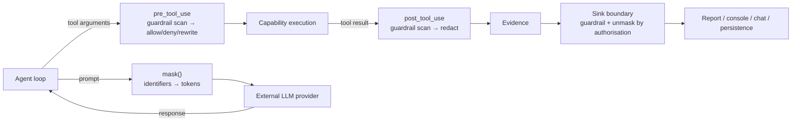

# Plan — 008 Guardrails and Masking

## Summary

Adopt Tracer's masking detectors and guardrail engine — both already
ReDoS-reviewed and span-merge-correct upstream — wire them into the runtime hook
points from feature 004, and add per-team policy, hot reload, and the
external-surface redaction boundary.

## Technical context

| Aspect | Choice |
|---|---|
| Detection | Compiled regex detectors with contextual label requirements |
| Token format | `<KIND-N>` (e.g. `<POD-1>`), stable within a run, never colliding with real identifiers |
| Mapping storage | Run-scoped, persisted with the trace, flagged sensitive |
| Rules format | YAML at an operator-controlled path, hot-reloaded via a file watcher |
| Hook integration | `pre_tool_use` (arguments, may deny), `post_tool_use` (results), sink boundary (persistence and transmission) |
| Performance | Single-pass scan with a combined pattern where possible; bounded match count and input size |

## Constitution check

| Article | Satisfaction |
|---|---|
| I | Guardrail and masking actions are recorded, so evidence provenance stays intact through redaction |
| II | `MAX_SCAN_MATCHES`, `MAX_SCAN_INPUT_BYTES`, and masking budget are named constants |
| III | `block` at `pre_tool_use` is a denial primitive approvals also use |
| IV | Defence in depth behind feature 007; default rules cover secret shapes appearing in data |
| V | Applies at hook points, so identical under any runtime |
| VI | `local_models_exempt` policy exists precisely because provider neutrality changes the threat model |
| VII | Masking-on vs masking-off is an ablation axis in the evaluation suite |
| VIII | `platform/{masking,guardrails}/` tier 3 |
| IX | Guardrails read capability metadata to decide scan scope |
| X | Masking is what makes a cloud provider acceptable for an operator who cannot leak identifiers |
| XI | Mappings and audits persist through ports |
| XII | ReDoS corpus and span-merge golden tests written first |
| XIII | Provenance headers; detectors adopted with attribution |

**Violations:** none.

## Project structure

```
platform/masking/
├── policy.py             # MaskingPolicy, levels, custom patterns
├── detectors.py          # regex detectors, contextual matching
├── mapping.py            # MaskMapping, stable token allocation
├── apply.py              # mask() / unmask() at the boundary
└── context.py            # run-scoped masking context

platform/guardrails/
├── rules.py              # GuardrailRule, YAML loading, hot reload
├── engine.py             # scan, span merge, redact/block/audit
├── audit.py              # action recording
├── sinks.py              # external-surface redaction boundary
├── defaults/
│   └── rules.yml         # shipped secret-shape rules
└── hooks.py              # pre_tool_use / post_tool_use bindings

tests/security/
├── test_redos_corpus.py
├── test_masking_boundary.py
└── test_external_surface_redaction.py
```

## Where each control applies



Masking applies **only** at the external-LLM boundary, because internal storage is
the operator's own database. Guardrails apply at all three points.

## Masking policy levels

| Level | Behaviour |
|---|---|
| `off` | No masking. Appropriate only where the provider is trusted with identifiers. |
| `standard` | Pods, clusters, namespaces, account IDs, ARNs, hostnames, IPs. Default. |
| `strict` | Adds service and deployment names, plus operator custom patterns. Higher risk of degrading model reasoning; measured by the evaluation suite. |
| `local_models_exempt` | Behaves as `standard` for cloud providers and `off` for local ones, resolved per call from the provider descriptor. |

## Implementation phases

### Phase 1 — Corpus and goldens (test-first)
ReDoS corpus, span-merge golden cases, masking boundary interception test, and
external-surface redaction test. All red.

### Phase 2 — Masking
Detectors, contextual matching, stable token allocation, mapping storage, mask and
unmask, policy levels.

### Phase 3 — Guardrail engine
Rule model, YAML loading, hot reload with last-known-good retention, scan with
bounded match count, deterministic span merging, the three actions.

### Phase 4 — Hook integration
`pre_tool_use` with denial and rewrite, `post_tool_use` redaction, mapping applied
at the LLM boundary via the provider layer.

### Phase 5 — Sink boundary
External-surface redaction for HTTP and chat sinks, authorisation-aware
restoration, local-CLI full-detail path.

### Phase 6 — Defaults and operations
Shipped secret-shape rules, audit recording, per-team policy resolution,
performance validation.

## Complexity tracking

| Item | Justification |
|---|---|
| Reversible masking rather than plain redaction | Redaction destroys the report's usefulness — an on-call engineer cannot act on `<REDACTED> is OOMKilling`. Reversibility is what makes masking acceptable to use by default. |
| Stable tokens within a run | Random per-occurrence tokens would prevent the model from correlating the same pod across two evidence sources, which is most of what investigation is. Stability costs a mapping table. |
| Three application points for guardrails | Arguments, results, and sinks are genuinely different threat surfaces: an argument can exfiltrate, a result can poison, a sink can publish. One point would miss two. |
| Hot reload with last-known-good | Operators tune rules during incidents. A parse error that starts the platform unguarded is worse than one that keeps the old rules and complains loudly. |

## Provenance

| Adopted from | Upstream path | Disposition |
|---|---|---|
| Tracer | `platform/masking/{detectors,policy,context}.py` | ADOPT — ReDoS-hardened upstream |
| Tracer | `platform/guardrails/{rules,engine,apply,audit,stream}.py` | ADOPT — span merging is subtle and already correct |
| Tracer | `_MergedSpan` representative-rule semantics | ADOPT — pinned by SC-004 golden test |
| Tracer | External-surface exception redaction discipline (CWE-209 handling) | ADOPT → `guardrails/sinks.py` |
| Swapnil | `sre-agent/tool_output_sanitize.py` | ADAPT → merged into `post_tool_use` scanning |

## Risks

| Risk | Mitigation |
|---|---|
| Masking degrades investigation quality | Ablation in the evaluation suite quantifies the cost per policy level; `standard` is the default precisely because it is the measured sweet spot, and operators can move deliberately |
| A detector misses a new identifier shape | Operator custom patterns (FR-003) plus `audit`-action rules let a gap be observed before it is enforced |
| ReDoS in an operator-supplied custom pattern | Custom patterns are compiled with a timeout and validated against the ReDoS corpus at load; a failing pattern is rejected with a clear message rather than silently accepted |
| Over-redaction hides evidence the engineer needs | Redaction happens at the sink with authorisation awareness (FR-021); the local CLI and the authorised console view see restored content |
| Token collision with real text | Token format is chosen to be improbable in infrastructure output and is verified against the evidence corpus at test time |
