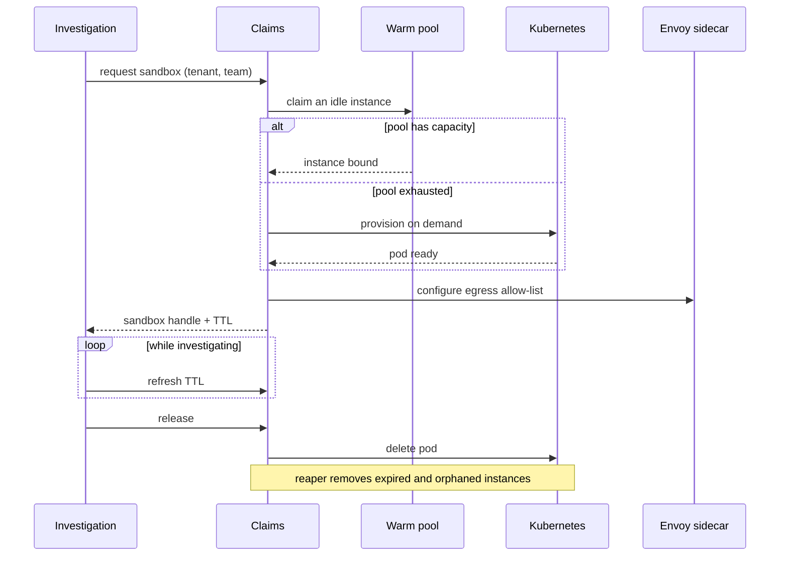

# Plan — 009 Sandbox Profiles

## Summary

Define one `Sandbox` port with a shared contract suite, then implement three
profiles. Adapt Swapnil's Kubernetes sandbox manager — pod-per-thread with an
Envoy egress sidecar, warm pool, TTL, and claims — splitting its 76KB monolith
into focused modules. Build the `process` and `container` profiles fresh against
the same contract.

## Technical context

| Aspect | Choice |
|---|---|
| Port | `Sandbox` protocol: provision, execute, stream, interrupt, release |
| `process` | Subprocess with `resource` limits on POSIX and Job Objects on Windows; egress via a loopback-only proxy route |
| `container` | Docker/Podman via the API; read-only root, tmpfs scratch, custom network with proxy-only routing |
| `kubernetes` | Pod per investigation, Envoy sidecar egress enforcement, warm pool with claims, TTL annotations |
| Egress enforcement | `process`/`container`: network configuration plus proxy routing. `kubernetes`: Envoy allow-list, independent of application cooperation |
| Reaper | Claim-based with a lease, safe across replicas |
| Content delivery | Capability and skill content mounted read-only from an immutable source |

## Constitution check

| Article | Satisfaction |
|---|---|
| I | Sandbox lifecycle events enter the run trace (FR-021) |
| II | CPU, memory, wall clock, scratch, process count, TTL, pool size — all named constants |
| III | Sandbox bounds what a capability can reach even before approval gates what it may do |
| IV | Reinforces feature 007: with no credential present, isolation is defence in depth rather than the primary control |
| V | Runtime-agnostic; the runtime calls the port |
| VI | No provider coupling |
| VII | N/A |
| VIII | `platform/sandbox/` tier 3 |
| IX | FR-020 — a sandbox cannot modify the capability content it will execute |
| X | Egress allow-list means a capability cannot reach anything the operator did not configure |
| XI | Claims and instances persist through ports |
| XII | The contract suite (SC-001) is written before any profile |
| XIII | Provenance headers on adapted Kubernetes code |

**Violations:** none.

## Project structure

```
platform/sandbox/
├── port.py                   # Sandbox protocol
├── spec.py                   # SandboxSpec, resource limits, EgressPolicy
├── selection.py              # deployment-level profile resolution
├── reaper.py                 # concurrent-safe cleanup with leases
├── health.py
├── profiles/
│   ├── process/
│   │   ├── runner.py
│   │   ├── limits_posix.py
│   │   └── limits_windows.py     # Job Objects; documented gaps
│   ├── container/
│   │   ├── runner.py
│   │   ├── image.py
│   │   └── network.py
│   └── kubernetes/
│       ├── runner.py
│       ├── pod_spec.py
│       ├── envoy.py              # sidecar config from the egress allow-list
│       ├── warm_pool.py
│       ├── claims.py
│       └── ttl.py
└── content.py                # immutable capability/skill delivery

tests/contract/sandbox/       # one suite, three profiles
tests/security/test_sandbox_isolation.py
```

## Egress enforcement per profile

| Profile | Mechanism | Strength |
|---|---|---|
| `process` | Proxy-only routing plus a loopback-restricted network namespace where the OS supports it | Adequate for single-tenant development |
| `container` | Dedicated bridge network with no default route; only the proxy is reachable | Strong; a capability cannot route elsewhere |
| `kubernetes` | Envoy sidecar with an explicit allow-list; all egress via the sidecar; `NetworkPolicy` denying direct pod egress | Strongest; enforced outside the application |

`EgressPolicy` is derived from the union of `InjectionRule.hosts` (feature 007)
for the team's configured integrations, plus the proxy itself. One source of
truth, three enforcement mechanisms.

## Kubernetes lifecycle



## Implementation phases

### Phase 1 — Port and contract suite (test-first)
`port.py`, `spec.py`, the shared contract suite, and the isolation and egress
security tests. All red.

### Phase 2 — Process profile
POSIX and Windows limit enforcement, proxy-only routing, interruption. Contract
suite green for one profile; Windows gaps documented and reported at start.

### Phase 3 — Container profile
Image build, read-only root with tmpfs scratch, dedicated network, lifecycle,
interruption.

### Phase 4 — Kubernetes profile
Pod spec, Envoy sidecar generation from the egress policy, `NetworkPolicy`,
execution and streaming, interruption.

### Phase 5 — Pool and claims
Warm pool, claim binding with leases, TTL refresh, single-tenant reset guarantee.

### Phase 6 — Reaper and operations
Concurrent-safe reaping, orphan detection, health reporting, trace events, and
verification of every success criterion.

## Complexity tracking

| Item | Justification |
|---|---|
| Three profiles instead of one | Requiring Kubernetes for local development is the reason contributors avoid isolation entirely. Three profiles behind one contract suite keeps behaviour identical while meeting real deployment constraints. |
| Envoy sidecar in the Kubernetes profile | Application-level egress restriction is cooperative and therefore not a control. Enforcing outside the process is what makes the enterprise profile defensible in a security review. |
| Warm pool | Provisioning a pod per investigation adds seconds to every incident response. The pool moves that cost off the critical path; the claim mechanism is what makes it safe across replicas. |
| No unsandboxed fallback (FR-006) | Same reasoning as ADR 0005: a fallback is what gets used during an incident and never reverted. Failing loudly is the correct behaviour. |
| Windows `process` profile with weaker limits | Contributors on Windows need a working local environment. The gap is reported at start and the profile is documented as development-only, so the weaker guarantee is never mistaken for the production one. |

## Provenance

| Adopted from | Upstream path | Disposition |
|---|---|---|
| Swapnil | `sre-agent/sandbox_manager.py` (76KB) | ADAPT → split into `profiles/kubernetes/{runner,pod_spec,envoy,warm_pool,claims,ttl}.py` |
| Swapnil | Envoy configmap generation and egress control | ADOPT → `envoy.py` |
| Swapnil | Warm pool, claims, TTL, JWT injection | ADAPT |
| Swapnil | `sre-agent/sandbox-router/` | ADAPT → routing folded into the port |
| Swapnil | Skills baked into the sandbox image | ADAPT → `content.py` immutable read-only delivery |
| Tracer | `platform/sandbox/{capabilities,runner}.py` | ADAPT → `profiles/process/` |
| Tracer | `tools/interactive_shell/shared/execution_policy.py` | ADAPT → resource-limit policy |

## Risks

| Risk | Mitigation |
|---|---|
| Behaviour diverges between profiles | One contract suite for all three (SC-001); a capability that passes on `process` and fails on `kubernetes` is a contract-suite gap, treated as a bug in the suite |
| Warm-pool exhaustion under burst | On-demand provisioning behind the pool, plus health metrics exposing exhaustion so pool size can be tuned before it bites |
| Long-running capabilities exceed TTL | TTL refresh while the investigation is active (FR-014); capabilities declare expected duration so the spec can size the TTL |
| Orphaned sandboxes accumulate cost | Lease-based reaper safe across replicas (FR-015), verified by SC-005 killing the agent mid-run |
| Envoy configuration drift as integrations change | The allow-list derives from `InjectionRule.hosts`, the same source feature 007 uses, so adding an integration updates both by construction |
