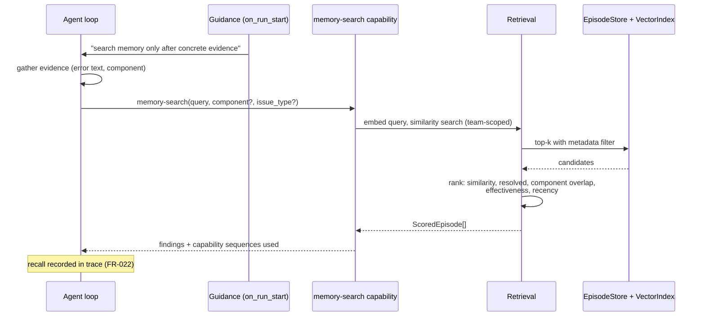

# Plan — 010 Episodic Memory

## Summary

Adopt Swapnil's episode model and extraction, rewrite storage and retrieval over
Postgres + pgvector, and wire recall as an agent-driven capability with guidance
appended to the root prompt. Add the ablation switches and trace recording that
make memory's contribution measurable.

## Technical context

| Aspect | Choice |
|---|---|
| Storage | `EpisodeStore` + `VectorIndex` over Postgres (feature 006) |
| Embeddings | Pluggable provider; default a local sentence-transformer, with cloud providers optional |
| Extraction | One post-turn LLM call producing a structured `EpisodeExtraction` |
| Recall | A `memory-search` capability in `capabilities/tools/system/` |
| Guidance | Appended to the root system prompt by `on_run_start` |
| Finalisation | `on_run_end` hook, exactly-once |
| Ranking | Deterministic weighted combination, no LLM in the retrieval path |

## Constitution check

| Article | Satisfaction |
|---|---|
| I | FR-022 — every recall recorded; findings carry the capability and query that produced them |
| II | Retrieval result count, extraction token budget, and minimum result length are named constants |
| III | Memory is read-only with respect to production |
| IV | Episode content passes guardrails before persistence (FR-024) |
| V | Hooks are runtime-level, so memory behaves identically under any runtime |
| VI | FR-017 — local embedding model keeps memory working with no egress |
| VII | **This is the feature's central obligation.** FR-020, FR-021, SC-003, SC-004 |
| VIII | `platform/memory/` tier 3; the capability lives in `capabilities/` tier 2 |
| IX | Recall is a declared capability with metadata, scored like any other |
| X | Embeddings and episodes stay in the operator's database |
| XI | Storage only through `EpisodeStore` and `VectorIndex` |
| XII | Ablation tests and the one-episode-per-conversation test written first |
| XIII | Provenance headers; the episode model is adopted from Swapnil with attribution |

**Violations:** none.

## Project structure

```
platform/memory/
├── models.py              # Episode, Component, KeyFinding, ScoredEpisode
├── extraction.py          # post-turn structured extraction
├── effectiveness.py       # the documented scoring formula
├── embeddings/
│   ├── port.py            # Embedder protocol
│   ├── local.py           # default local model
│   ├── provider.py        # cloud embedding providers
│   └── generations.py     # model/dimension recording, re-embed swap
├── retrieval.py           # similarity search + ranking
├── ranking.py             # documented weights
├── policy.py              # MemoryPolicy — per-team ablation switches
├── guidance.py            # root-prompt guidance text
└── lifecycle.py           # on_run_end finalisation, exactly-once

capabilities/tools/system/memory_search/
├── tool.py                # the memory-search capability
└── results.py             # result shaping for the agent
```

## The effectiveness formula (FR-007)

Documented, versioned, and testable rather than a prose heuristic:

```
effectiveness = w_resolved   * resolved
              + w_rootcause  * has_root_cause
              + w_evidence   * evidence_backing_ratio
              + w_trajectory * trajectory_efficiency
```

where `evidence_backing_ratio` is validated claims over total claims, and
`trajectory_efficiency` is a bounded inverse of iterations used. Weights are named
constants; the formula version is stored on the episode so a weight change does
not silently reinterpret history.

## Recall flow



## Implementation phases

### Phase 1 — Model and contracts (test-first)
`models.py`, the `Embedder` port, `MemoryPolicy`, and the tests for
one-episode-per-conversation, prompt-purity (SC-002), and ablation identity
(SC-004). All red.

### Phase 2 — Embeddings
Port, local default model, cloud providers, generation recording, dimension
mismatch failure.

### Phase 3 — Extraction and effectiveness
Structured post-turn extraction, the documented effectiveness formula, failure
isolation so extraction never fails a run.

### Phase 4 — Storage and finalisation
`lifecycle.py` on the `on_run_end` hook, upsert semantics, concurrency safety,
guardrail filtering before persistence.

### Phase 5 — Retrieval and ranking
Similarity search, the weighted ranking with documented weights, team scoping,
empty-result handling.

### Phase 6 — Capability and guidance
The `memory-search` capability with full metadata, root-prompt guidance, trace
recording of every recall.

### Phase 7 — Ablation and proof
Ablation switches, the repeat-scenario improvement measurement (SC-003), the
disabled-memory baseline check (SC-004), re-embedding at scale (SC-008).

## Complexity tracking

| Item | Justification |
|---|---|
| Agent-driven recall rather than pre-injection | Costs an extra capability call per investigation, and is worth it: pre-injection on a vague alert anchors the agent on superficially-similar-but-wrong episodes. Upstream reached the same conclusion after shipping the alternative. |
| Documented effectiveness formula rather than a heuristic | Effectiveness feeds ranking, which changes agent behaviour. A prose heuristic cannot be versioned, tested, or reasoned about when scores shift. |
| Ablation switches as a first-class feature | Article VII makes this non-optional. Without them, "memory helps" is unfalsifiable — which is exactly the gap in the memory-side upstream. |
| Pluggable embeddings with a local default | A cloud embedding call on every episode write and every recall would break the no-egress deployment that motivates the product. |

## Provenance

| Adopted from | Upstream path | Disposition |
|---|---|---|
| Swapnil | `sre-agent/memory/models.py` | ADOPT — clean, well-shaped domain model |
| Swapnil | `sre-agent/memory/extraction.py` | ADOPT → `extraction.py`, `effectiveness.py` |
| Swapnil | `sre-agent/memory/store.py` (Neo4j) | REWRITE → `EpisodeStore` over Postgres |
| Swapnil | `sre-agent/memory/retrieval.py` (`neo4j-graphrag`) | REWRITE → pgvector similarity, `ScoredEpisode` ranking retained |
| Swapnil | `sre-agent/memory/embeddings.py` | ADAPT → pluggable port with a local default |
| Swapnil | `sre-agent/investigation_lifecycle.py` | ADAPT → `lifecycle.py` + `guidance.py` |
| Swapnil | `.claude/skills/memory-search/` | ADAPT → typed capability |
| Tracer | `core/domain/memory/` file-based notes | ADAPT → complementary operator-authored context (feature 012) |
| Tracer | `core/domain/feedback/misses/` | ADOPT → miss taxonomy feeding the evaluation loop |

## Risks

| Risk | Mitigation |
|---|---|
| Memory makes investigations worse by anchoring on wrong precedents | SC-003 and SC-004 measure it both ways; ranking demotes unresolved and low-effectiveness episodes; if the number says memory hurts, the ablation switch is already there |
| Retrieval latency on the critical path | Deterministic ranking with no LLM call; HNSW search validated at 100k episodes in feature 006 |
| Extraction cost per investigation | One structured call with a bounded token budget; skipped entirely for short results (FR-006) |
| Embedding model drift invalidates the corpus | Generations with atomic swap (FR-019); the model is recorded per row so mixed generations are detectable rather than silently compared |
| Episodes leak sensitive content | Guardrail filtering before persistence (FR-024), and team scoping enforced at the port (SC-005) |
