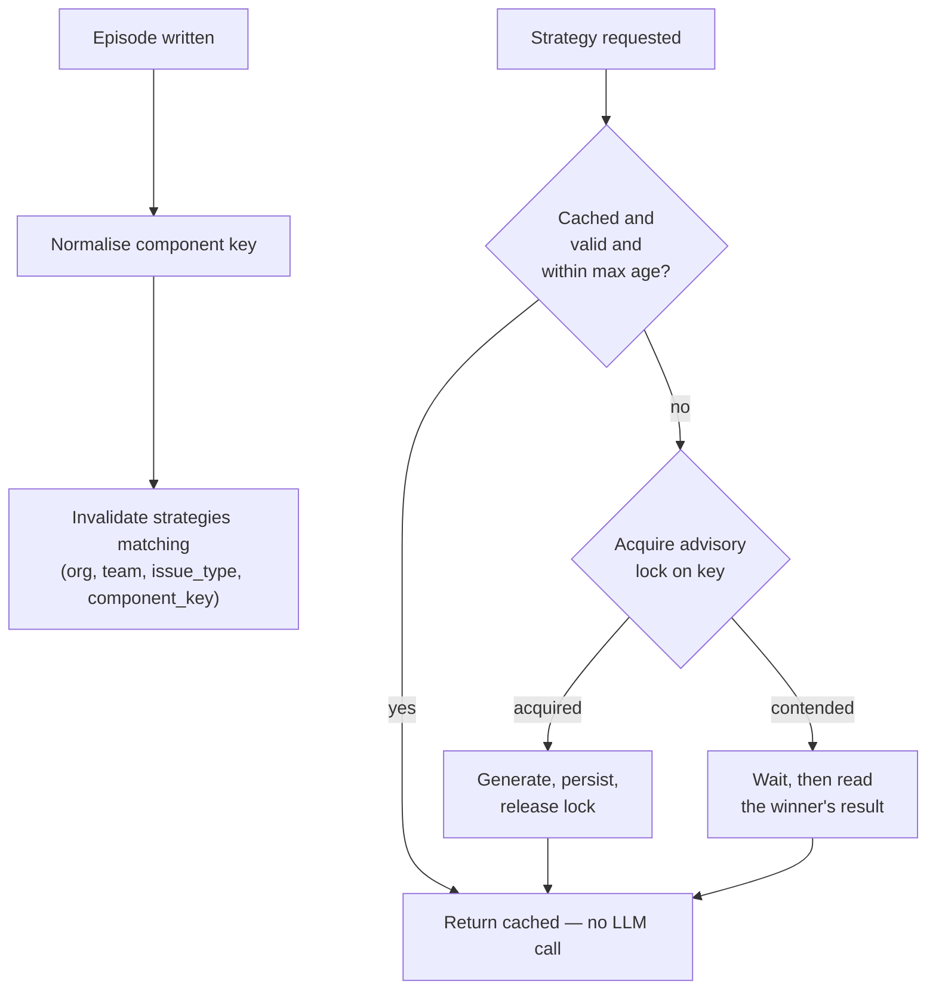

# Plan — 011 Strategy Synthesis

## Summary

Adopt Swapnil's `StrategyGenerator` — the single highest-value file in either
upstream — and harden it: cached generation with real invalidation, component-key
normalisation, concurrency safety, operator-edit preservation, and the ablation
switch Article VII requires.

## Technical context

| Aspect | Choice |
|---|---|
| Storage | Relational strategies keyed on `(org, team, issue_type, component_key)` |
| Generation | One structured LLM call over the scored episode set |
| Invalidation | Episode write triggers invalidation for the matching key |
| Concurrency | Advisory lock on the strategy key; losers wait and read the winner's result |
| Normalisation | Documented rules plus an operator alias map, conservative by default |
| Prompt versioning | The synthesis prompt carries a version stored on the strategy |

## Constitution check

| Article | Satisfaction |
|---|---|
| I | Source episode ids are recorded, so every playbook claim is traceable to the runs behind it |
| II | Episode threshold, output length, max age, and input set size are named constants |
| III | Strategies recommend; they never execute |
| IV | Strategy content passes guardrails before persistence (FR-019) |
| V | Runtime-agnostic |
| VI | Synthesis uses the provider abstraction; works on a local model |
| VII | **Central.** FR-017 ablation, SC-005 proof of value, SC-006 baseline check |
| VIII | `platform/memory/strategy/` tier 3 |
| IX | Strategies surface through the existing memory capability, not a new ad-hoc path |
| X | Nothing leaves the operator's database |
| XI | Storage through `EpisodeStore`'s strategy methods |
| XII | Anti-pattern derivation and invalidation tests written first |
| XIII | Provenance header; adopted from Swapnil with attribution |

**Violations:** none.

## Project structure

```
platform/memory/strategy/
├── models.py            # Strategy, StrategyKey, OperatorEdit
├── generator.py         # synthesis over a scored episode set
├── prompt.py            # versioned synthesis prompt
├── cache.py             # get-or-generate, advisory lock, age check
├── invalidation.py      # episode-write triggered invalidation
├── normalisation.py     # component key normalisation + alias map
└── policy.py            # per-team ablation switch
```

## The synthesis prompt (structure, versioned)

Input: N scored episodes with resolution status, effectiveness, root cause,
capabilities used, and summary.

Output sections, in order:

1. **Common root causes** — patterns recurring across episodes
2. **Recommended investigation steps** — ordered by observed effectiveness
3. **Key capabilities and queries** — what actually produced findings
4. **Anti-patterns** — drawn explicitly from unresolved and low-effectiveness
   episodes: approaches that looked promising and did not help

Bounded by `STRATEGY_MAX_OUTPUT_TOKENS`. The prompt version is stored on the
strategy so a prompt change is distinguishable from an input change.

## Component normalisation (FR-012, FR-013)

Conservative, documented, operator-extensible:

| Rule | Example | Direction |
|---|---|---|
| Strip common suffixes | `payments-api`, `payments-service` → `payments` | merge |
| Strip environment prefixes/suffixes | `prod-payments`, `payments-prod` → `payments` | merge |
| Strip replica and hash segments | `payments-7f9dd8b6c4-x7gr9` → `payments` | merge |
| Case and separator normalisation | `PaymentsAPI`, `payments_api` → `payments` | merge |
| Operator alias map | `checkout` ≡ `cart-service` | merge, explicit |
| Anything else | `payments` vs `payment-gateway` | keep distinct |

Type is always part of the key, so a `service:payments` never merges with a
`database:payments`. SC-007 asserts both merge and non-merge directions against a
fixture table.

## Invalidation and concurrency



## Implementation phases

### Phase 1 — Model and contracts (test-first)
`models.py`, `policy.py`, and the tests for anti-pattern derivation (SC-001),
cache-hit-no-LLM (SC-002), invalidation (SC-003), concurrency (SC-004), and
ablation baseline (SC-006). All red.

### Phase 2 — Normalisation
Documented rules, operator alias map, the fixture table asserting merge and
non-merge behaviour (SC-007).

### Phase 3 — Generation
Versioned prompt, structured synthesis, output bounding, source recording, failure
isolation (SC-008).

### Phase 4 — Cache and invalidation
Get-or-generate, advisory lock, age-based regeneration, episode-write invalidation
hook.

### Phase 5 — Delivery
Strategies surfaced through the memory capability, labelled distinctly, carrying
episode count and date range.

### Phase 6 — Operator edits and proof
Edit preservation across regeneration, the ablation switch, and the value
measurement (SC-005).

## Complexity tracking

| Item | Justification |
|---|---|
| Component normalisation | Without it, `payments`, `payments-api`, and `payments-7f9dd-x7gr9` are three separate strategy keys and the episode threshold is never reached. Upstream ships without it, which is why strategies rarely trigger there. |
| Advisory-lock concurrency | An alert storm produces N concurrent investigations on the same component. Without the lock that is N synthesis calls producing N slightly different playbooks. |
| Operator edit preservation | A human correcting a playbook is the highest-quality signal available. Overwriting it on the next regeneration would train operators to stop correcting. |
| Prompt versioning on the stored strategy | Without it, a prompt change silently reinterprets every cached playbook and no one can tell why quality shifted. |

## Provenance

| Adopted from | Upstream path | Disposition |
|---|---|---|
| Swapnil | `sre-agent/memory/strategy.py` | ADOPT — prompt structure and anti-pattern derivation retained verbatim in intent |
| Swapnil | `Strategy` model | ADOPT (via feature 010's model port) |
| Swapnil | `StrategyGenerator.get_or_generate` | ADAPT → real invalidation, locking, and age handling added |
| Swapnil | Web console strategy pages | REFERENCE → informs feature 021 |

## Risks

| Risk | Mitigation |
|---|---|
| A playbook encodes a systematic error | Source episode ids recorded for traceability; operator editability; ablation measurement catches aggregate degradation |
| Over-merged component keys produce nonsense strategies | Conservative normalisation with explicit non-merge fixtures (SC-007); the alias map requires an operator decision rather than inference |
| Stale strategies describe retired infrastructure | `STRATEGY_MAX_AGE_DAYS` forces regeneration (FR-011); date range is surfaced so the agent can discount an old playbook |
| Synthesis cost grows with episode volume | Input set is bounded by a named constant taking the top-scored episodes; generation happens off the critical path via caching |
| Strategies crowd out fresh reasoning | They are labelled as synthesised with their episode count (FR-014, FR-015), so the agent weighs rather than obeys them; ablation quantifies the net effect |
