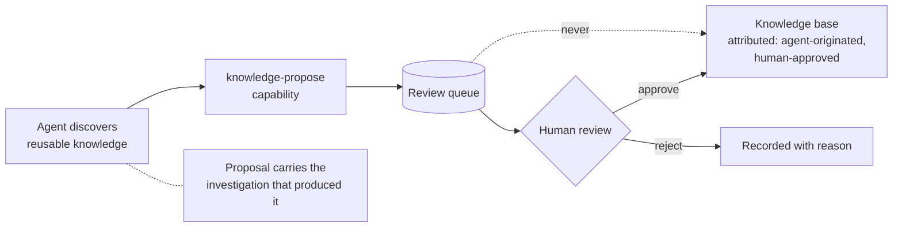

# Plan — 012 Knowledge Graph and Knowledge Base

## Summary

Implement topology over the Apache AGE traversal catalogue from feature 006, and a
chunked, embedded knowledge base over pgvector. Expose both as agent-driven
capabilities with the same recall discipline as episodic memory. Add discovery
adapters, reconciliation that preserves human input, and a review queue for
agent-proposed knowledge.

## Technical context

| Aspect | Choice |
|---|---|
| Graph | Apache AGE via `TopologyGraph` port — the fixed nine-query catalogue only |
| Knowledge storage | Documents and chunks over `KnowledgeStore` + `VectorIndex` |
| Chunking | Semantic chunking with overlap, bounded chunk size, section-aware |
| Discovery | Adapter port with Kubernetes, service-mesh, and trace-derived implementations |
| Reconciliation | Three-way: discovered, existing, operator-annotated |
| Review | Reuses the approval machinery from feature 015 |
| Recall | Two capabilities: `topology-query` and `knowledge-search` |

## Constitution check

| Article | Satisfaction |
|---|---|
| I | FR-013 — knowledge results are citable with source and location, so a claim can name its document |
| II | `MAX_GRAPH_DEPTH`, `MAX_GRAPH_RESULTS`, chunk size and count are named constants |
| III | FR-017 — agent-proposed knowledge requires human approval, the same default-deny posture as production writes |
| IV | FR-015 — ingestion rejects documents containing detected secrets |
| V | Runtime-agnostic capabilities |
| VI | Chunk embeddings use the pluggable embedder from feature 010; local models work |
| VII | FR-024 — independent ablation switches; SC-008 baseline checks |
| VIII | `platform/knowledge/` tier 3; capabilities in tier 2 |
| IX | FR-022 — both are declared capabilities with metadata, scored like any other |
| X | Everything stays in the operator's database; sync pulls from their own systems |
| XI | Graph and vector access only through ports |
| XII | Cycle, reconciliation, and approval-bypass tests written first |
| XIII | Provenance headers |

**Violations:** none.

## Project structure

```
platform/knowledge/
├── topology/
│   ├── models.py            # ServiceNode, DependencyEdge, BlastRadius
│   ├── queries.py           # thin wrapper over the TopologyGraph port
│   ├── reconciliation.py    # three-way merge preserving annotations
│   ├── import_.py           # declarative topology-as-code
│   └── discovery/
│       ├── port.py
│       ├── kubernetes.py    # services, endpoints, owner references
│       ├── mesh.py          # service-mesh telemetry
│       └── traces.py        # trace-derived dependencies
├── base/
│   ├── models.py            # KnowledgeDocument, KnowledgeChunk, tree nodes
│   ├── ingestion.py         # chunking, embedding, guardrail screening
│   ├── chunking.py          # section-aware with overlap
│   ├── search.py            # citable chunk retrieval
│   ├── tree.py              # hierarchy
│   └── sync/                # Confluence, Notion, Google Docs, Git
├── proposals.py             # agent-proposed changes + review queue
└── policy.py                # independent ablation switches

capabilities/tools/system/
├── topology_query/tool.py
├── knowledge_search/tool.py
└── knowledge_propose/tool.py
```

## Topology reconciliation (FR-007, FR-008)

Three-way merge on each discovery run:

| Situation | Action |
|---|---|
| Discovered, not existing | Add edge, mark verified with timestamp |
| Discovered, existing | Refresh verification timestamp; keep annotations |
| Existing, not discovered, discovery source healthy | Remove edge |
| Existing, not discovered, discovery source degraded | **Mark unverified**, do not remove |
| Operator-annotated node or edge | Annotations always preserved; never overwritten by discovery |
| Operator-authored edge not discoverable | Never removed by discovery |

The degraded case (FR-008) is what prevents a transient Kubernetes API failure
from silently deleting a team's topology.

## Recall discipline

Identical to feature 010, deliberately:

```
on_run_start guidance:
  "Service topology is NOT pre-loaded. After you identify an affected service
   or deployment, query topology for dependencies and blast radius."
  "Runbooks are NOT pre-loaded. After you have concrete symptoms, search the
   knowledge base with a specific query."
```

Both capabilities record their query and results in the trace (FR-023).

## Agent-proposed knowledge flow



The dotted line is the invariant SC-007 asserts: there is no path from proposal to
knowledge base that bypasses review.

## Implementation phases

### Phase 1 — Models and contracts (test-first)
Topology and knowledge models, ablation policy, and the tests for cycles (SC-002),
reconciliation (SC-003, SC-004), approval bypass (SC-007), and secret rejection
(SC-006). All red.

### Phase 2 — Topology core
Query wrapper over the port, bounded traversal with truncation reporting, cycle
handling, graceful degradation.

### Phase 3 — Topology population
Declarative import, discovery port, Kubernetes adapter, reconciliation with
annotation preservation and the degraded-source path.

### Phase 4 — Knowledge ingestion
Section-aware chunking with overlap, embedding, guardrail screening with location
reporting, tree hierarchy.

### Phase 5 — Knowledge search
Citable chunk retrieval with source and location, team scoping, empty-result
handling.

### Phase 6 — Capabilities and proposals
Three capabilities with full metadata, root-prompt guidance, proposal queue over
the approval machinery, attribution on approval.

### Phase 7 — Sync, ablation, scale
Confluence, Notion, Google Docs, and Git sync; independent ablation switches;
10k-node blast radius validation (SC-001).

## Complexity tracking

| Item | Justification |
|---|---|
| Three-way reconciliation rather than replace | Replace-on-discovery destroys operator annotations and, worse, deletes a team's topology when the Kubernetes API has a bad minute. The degraded-source path (FR-008) is the specific defence. |
| Fixed query catalogue rather than flexible graph queries | Feature 006's constraint, inherited deliberately. The upstream generates Cypher with an LLM, which is both a correctness risk and an injection surface. Nine bounded traversals cover the actual investigative need. |
| Review queue for agent-proposed knowledge | An agent that writes knowledge it later reads, unreviewed, builds a self-reinforcing belief system with no external correction. Human review is the only available loop breaker. |
| Topology and knowledge base as one feature | They share recall discipline, ablation shape, team scoping, and the review workflow. Splitting duplicates four mechanisms for no benefit. |

## Provenance

| Adopted from | Upstream path | Disposition |
|---|---|---|
| Swapnil | `sre-agent/tools/neo4j_semantic_layer.py` | REWRITE → `topology/` over AGE, parameterised queries replacing LLM-generated Cypher |
| Swapnil | `.claude/skills/infrastructure-neo4j/` | ADAPT → `topology_query` capability |
| Swapnil | `scripts/populate_neo4j.py`, `populate_neo4j.cypher` | ADAPT → `topology/import_.py` and the Kubernetes discovery adapter |
| Swapnil | Knowledge tree, RAPTOR, and teaching endpoints | ADAPT → `base/` with the review queue |
| Swapnil | `.claude/skills/knowledge-base/` (Confluence) | ADAPT → `base/sync/confluence.py` |
| Swapnil | Proposed-changes approve/reject flow | ADOPT → `proposals.py` |
| Tracer | `core/domain/memory/` file-based notes with frontmatter | ADAPT → operator-authored documents in the knowledge base |
| Tracer | `tools/system/sre_guidance_tool/` | ADAPT → methodology surfacing alongside knowledge search |

## Risks

| Risk | Mitigation |
|---|---|
| Topology data is stale and misleads the agent | Verification timestamps surfaced with every result, so the agent can discount unverified edges; discovery adapters keep refresh cheap |
| Blast radius on a hub service returns thousands of nodes | Bounded by `MAX_GRAPH_RESULTS` with truncation reported (FR-004), so the agent knows the answer is partial |
| Knowledge base contradicts episodic memory | Both are surfaced with provenance; the agent weighs a cited runbook against an observed episode, and the conflict is visible rather than silently resolved |
| Documents contain secrets or PII | Guardrail screening on ingestion with rejection and location reporting (FR-015, SC-006) |
| Discovery partially fails and corrupts topology | Unverified marking instead of deletion (FR-008, SC-004) |
| Graph adds operational burden | It is optional; investigations degrade gracefully without it (FR-009, SC-009), and it shares the single Postgres instance rather than adding a service |
