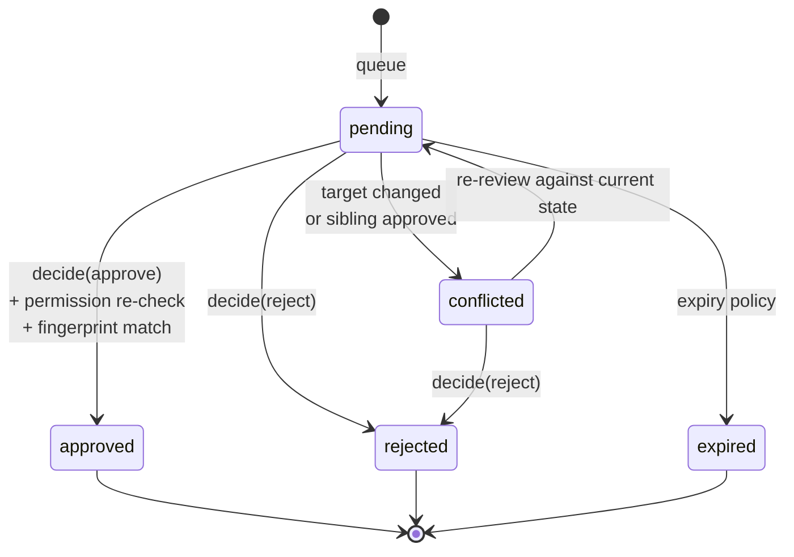

# Plan — 015 Change Approval and Security Policies

## Summary

Build one approval state machine serving every gated change type, plus the
org-level security policies that decide what is gated. Adopt Swapnil's
pending-changes and security-policy models; add conflict detection, decision-time
permission re-checking, blast-radius presentation, and cross-surface closure.

## Technical context

| Aspect | Choice |
|---|---|
| State machine | `pending → approved \| rejected \| expired \| conflicted`, with transitions only through the service |
| Storage | `ApprovalStore` (feature 006) |
| Conflict detection | Optimistic concurrency on a target-state fingerprint captured at queue time |
| Diff | Structured, type-aware per `ChangeType`; summarisation with drill-down for large diffs |
| Routing | Reviewer set derived from node-scoped permissions (feature 014) |
| Notification | Through the notification sinks (feature 023) |
| Cross-surface closure | A decision publishes an event every surface subscribes to |

## Constitution check

| Article | Satisfaction |
|---|---|
| I | FR-023 — the audit retains the diff, so a past decision is reconstructable |
| II | Expiry windows, diff size limits, reviewer notification limits are named constants |
| III | **Central.** This is the machinery Article III's "explicit human approval" requires |
| IV | Diffs pass the guardrail engine so a secret in a proposed value is not exposed in review or audit |
| V | Runtime-agnostic |
| VI | N/A |
| VII | N/A |
| VIII | `platform/approvals/` tier 3 |
| IX | Capability enablement changes flow through this mechanism |
| X | Everything stays in the operator's database |
| XI | Access through `ApprovalStore` |
| XII | The no-bypass test (SC-001) is written before the service |
| XIII | Provenance headers |

**Violations:** none.

## Project structure

```
platform/approvals/
├── models.py            # PendingChange, Decision, ChangeType, Conflict
├── state_machine.py     # the only path between states
├── service.py           # queue, decide, expire, conflict resolution
├── policy.py            # SecurityPolicy, evaluation, enforcement
├── diff/
│   ├── engine.py        # type-aware structured diff
│   ├── summarise.py     # large-diff summarisation with drill-down
│   └── renderers/       # config, prompt, capability, knowledge, remediation
├── blast_radius.py      # affected nodes and teams via inheritance
├── routing.py           # reviewer set from node-scoped permissions
├── notification.py      # reviewer notification
└── closure.py           # cross-surface decision propagation
```

## The state machine



Transitions occur only through `service.py`. `SC-001` asserts that no other code
path can move a change to `approved` or apply its payload.

## Conflict detection (FR-008, FR-009)

At queue time, a fingerprint of the target's current state is captured. At
decision time:

| Situation | Outcome |
|---|---|
| Fingerprint matches | Apply |
| Fingerprint differs | Mark `conflicted`; reviewer must re-review against current state |
| Sibling change to the same target approved first | Remaining siblings marked `conflicted` |
| Target node deleted | Marked `conflicted` with the reason; cannot be approved |

Blind application after divergence is the failure mode this prevents: a reviewer
approves a diff that no longer describes reality.

## Security policy model (FR-014, FR-015)

| Policy field | Effect |
|---|---|
| `require_approval_for` | Set of `ChangeType`s that must be gated |
| `require_approval_for_side_effect_levels` | Which capability side-effect levels need approval (feeds feature 017) |
| `allow_self_approval` | Default `false` |
| `locked_settings` | Config paths no descendant may override |
| `max_values` | Numeric ceilings enforced against every role |
| `required_settings` | Config paths that must be set |
| `allowed_values` | Enumerated permitted values per path |
| `token_expiry_days`, `token_warn_before_days`, `token_revoke_inactive_days` | Token lifecycle defaults |
| `change_expiry_hours` | Pending change lifetime |
| `log_all_changes` | Audit verbosity floor |

FR-016 is the key property: policy maximums bind owners too. Raising a ceiling
requires changing the policy, which is itself auditable and may be
approval-gated (FR-017).

## Implementation phases

### Phase 1 — Contracts and no-bypass proof (test-first)
Models, state machine skeleton, and the tests for no-bypass (SC-001),
self-approval refusal (SC-002), conflict blocking (SC-003), decision-time
permission re-check (SC-004), and owner-bound policy maximums (SC-006). All red.

### Phase 2 — State machine and service
Queue, decide, expire; transitions confined to the service; atomic application on
approval.

### Phase 3 — Conflict handling
Fingerprint capture and comparison, sibling conflict marking, deleted-target
handling, re-review path.

### Phase 4 — Policy
`SecurityPolicy` model, evaluation at every gated write, role-independent
enforcement, policy-change auditing and optional gating, explicit queue-effect
semantics on policy change.

### Phase 5 — Presentation
Type-aware diff renderers, large-diff summarisation with drill-down, blast-radius
computation.

### Phase 6 — Routing and closure
Reviewer set derivation, notification, cross-surface decision propagation.

### Phase 7 — Audit and integration
Full auditing including the retained diff; wire configuration (feature 013),
knowledge proposals (feature 012), and reserve the remediation path (feature 017).

## Complexity tracking

| Item | Justification |
|---|---|
| One mechanism for five change types | Config changes, prompt changes, capability toggles, knowledge additions, and production remediation are the same shape: proposal, reviewer, decision, audit. Five mechanisms would drift and one would end up weaker than the rest. |
| Conflict detection via fingerprint | Without it, a reviewer approving a two-day-old diff applies a change against state they never saw. This is the specific way approval workflows produce incidents. |
| Decision-time permission re-check | Offboarding between queue and decision is routine. Queue-time-only checking leaves departed employees with latent authority. |
| Diff summarisation rather than truncation | A truncated diff that looks complete is worse than no diff. Summarisation with drill-down keeps large changes reviewable while making the omission explicit. |

## Provenance

| Adopted from | Upstream path | Disposition |
|---|---|---|
| Swapnil | Pending-changes routes and review flow (`pending-changes/*/review`) | ADAPT → `state_machine.py`, `service.py` |
| Swapnil | `config_service/src/api/routes/security.py` `SecurityPolicy` model | ADOPT → `policy.py` |
| Swapnil | Knowledge proposed-changes approve/reject flow | ADAPT → unified into this mechanism |
| Swapnil | Remediation review and rollback routes | REFERENCE → feature 017 consumes this machinery |
| Tracer | `gateway/runtime/approvals.py`, `gateway/{slack,discord}/approvals.py` | ADAPT → `routing.py`, `closure.py`, and surface adapters |
| Tracer | `platform/guardrails/` | REUSE — diffs pass through before display and audit |

## Risks

| Risk | Mitigation |
|---|---|
| Approval fatigue causes rubber-stamping | Policy granularity (FR-014) lets teams gate only what matters; blast radius (FR-012) makes the stakes of each request visible rather than uniform |
| A change sits queued through an incident | Configurable expiry with notification (FR-006); remediation approvals in feature 017 carry a shorter, incident-appropriate window |
| Cross-surface state divergence | A single decision event that all surfaces subscribe to (FR-021, SC-005), rather than per-surface state |
| Large diffs are approved unread | Summarisation with explicit drill-down (FR-013, SC-008) and blast radius shown before the diff |
| Policy becomes a lock-out mechanism | Policy changes are auditable and may themselves be gated (FR-017); locked settings surface their locking node so the constraint is explainable |
