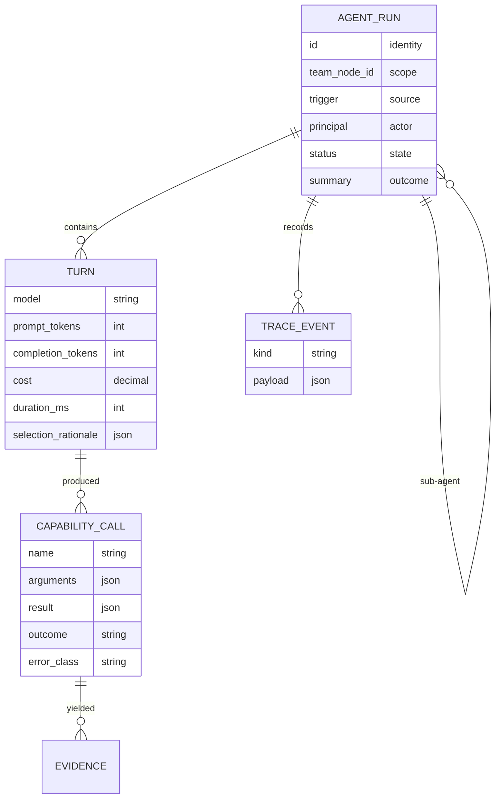
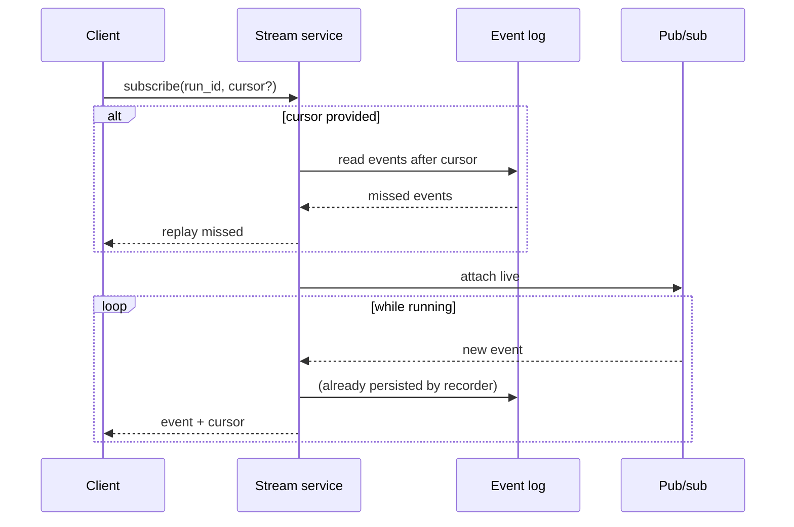

# Plan — 016 Agent Runs, Traces, and Scheduler

## Summary

Persist every investigation as a replayable trace through `RunTraceStore`, provide
cursor-based live streaming with reconnection, and build a lease-claimed scheduler
that runs recurring investigations exactly once across replicas.

## Technical context

| Aspect | Choice |
|---|---|
| Trace storage | `RunTraceStore` over Postgres; JSONB payloads with targeted expression indexes |
| Event stream | Append-only event log per run with a monotonic cursor |
| Live delivery | In-process pub/sub with a Postgres `LISTEN`/`NOTIFY` bridge across replicas |
| Reconnection | Client presents a cursor; the server replays from the log then attaches live |
| Scheduling | Cron expressions with IANA timezones; `croniter`-style evaluation |
| Claiming | Lease rows in `ScheduleStore` with expiry and heartbeat renewal |
| Concurrency | Semaphores keyed globally and per team, sized by named constants |

## Constitution check

| Article | Satisfaction |
|---|---|
| I | **Central.** The trace is what makes every conclusion auditable |
| II | Payload caps, concurrency limits, lease durations, retention windows are named constants |
| III | Scheduled runs obey the same approval gating as interactive ones — a schedule is not an autonomy bypass |
| IV | FR-006 — trace content passes guardrails before persistence |
| V | Traces are runtime-produced but runtime-agnostic in shape |
| VI | Per-turn model and cost recording works across all providers |
| VII | Traces are the evaluation suite's input; retention keeps the corpus intact |
| VIII | `platform/scheduler/` tier 3; run history read APIs in `gateway` tier 1 |
| IX | Capability calls persist with metadata so replay survives catalogue change |
| X | Traces stay in the operator's database |
| XI | Access through `RunTraceStore` and `ScheduleStore` |
| XII | Replay-completeness and exactly-once tests written first |
| XIII | Provenance headers |

**Violations:** none.

## Project structure

```
platform/runs/
├── recorder.py          # writes runs, turns, calls, trace events
├── replay.py            # reconstruct a run's view from the log
├── stream.py            # live pub/sub + cursor-based catch-up
├── cursor.py
├── truncation.py        # payload caps with explicit markers
└── retention.py         # per-class retention preserving summaries and audit

platform/scheduler/
├── models.py            # ScheduledJob, Claim
├── cron.py              # expression evaluation, timezone, DST handling
├── claiming.py          # lease acquisition, heartbeat, expiry
├── executor.py          # runs a claimed job through the pipeline
├── concurrency.py       # global and per-team limits
├── misfire.py           # skip / run-once / run-all policy
└── reaper.py            # expired leases, interrupted run marking
```

## Trace model



Sub-agent dispatches are nested `AGENT_RUN` rows (FR-004), so a sub-agent's
reasoning is as inspectable as the parent's.

## Streaming and reconnection



The event log is the source of truth; pub/sub is a delivery optimisation. That
ordering is what makes SC-004 (exactly-once on reconnect) achievable.

## Scheduler claiming

| Step | Behaviour |
|---|---|
| Due evaluation | Each replica independently computes due jobs from cron expressions |
| Claim attempt | Conditional insert of a lease row keyed on `(job_id, fire_time)`; unique constraint makes exactly one win |
| Heartbeat | The claiming replica renews its lease periodically while executing |
| Expiry | A lease not renewed within its window becomes claimable |
| Reaping | The reaper marks the abandoned run `interrupted` before the job is re-claimable |

The `(job_id, fire_time)` uniqueness is what delivers SC-002 without a distributed
lock service.

## DST handling (FR-021, SC-007)

| Transition | Behaviour |
|---|---|
| Spring forward — the fire time does not exist | Fire at the next valid time, once, recorded as shifted |
| Fall back — the fire time occurs twice | Fire once, on the first occurrence; the `(job_id, fire_time)` key prevents the second |

Both are tested explicitly, because "handled by the cron library" is where this
class of bug lives.

## Implementation phases

### Phase 1 — Contracts and proofs (test-first)
Replay-completeness, exactly-once claiming, reconnection, DST, and crash-recovery
tests. All red.

### Phase 2 — Recording
Run, turn, capability-call, and trace-event persistence; guardrail filtering;
payload caps with truncation markers; nested sub-agent runs.

### Phase 3 — Replay
Reconstruct the client view from the log; degrade gracefully for removed
capabilities; expose selection rationale.

### Phase 4 — Streaming
Event log with a monotonic cursor, in-process pub/sub, cross-replica bridge,
reconnect catch-up, multi-client observation.

### Phase 5 — Scheduler core
Cron evaluation with timezones and DST, lease claiming, heartbeat, executor
resolving effective configuration at execution time.

### Phase 6 — Scheduler robustness
Concurrency limits, misfire policy, lease reaping with interrupted marking,
deleted-team disabling.

### Phase 7 — Retention and integration
Per-class retention preserving summaries and audit; run history unified across
interactive and scheduled runs.

## Complexity tracking

| Item | Justification |
|---|---|
| Event log as source of truth, pub/sub as delivery | Pub/sub alone cannot serve a reconnecting client the events it missed. Log-first is what makes exactly-once reconnection (SC-004) possible rather than best-effort. |
| Nested runs for sub-agents | Flattening sub-agent work into the parent's trace would make it impossible to see what a sub-agent was given and what it returned — precisely the thing worth auditing about delegation. |
| Explicit DST tests | Cron libraries handle DST differently and often silently. A DR-validation job that skips a night, or runs twice, is a real failure that only surfaces twice a year. |
| Lease claiming rather than a lock service | Avoids adding a dependency (etcd, Redis, ZooKeeper) to a single-database deployment. A unique constraint on `(job_id, fire_time)` gives exactly-once for free. |

## Provenance

| Adopted from | Upstream path | Disposition |
|---|---|---|
| Swapnil | Agent-runs API and trace persistence | ADAPT → `platform/runs/` |
| Swapnil | Web console trace replay | REFERENCE → informs `replay.py` and feature 021 |
| Swapnil | `config_service/src/api/routes/scheduled_jobs.py`, `db/scheduled_jobs.py` | ADAPT → `platform/scheduler/` |
| Swapnil | `sre-agent/events.py` SSE protocol | ADOPT (via feature 005) |
| Tracer | `platform/scheduler/{claim_store,executor,runner,store,tasks}.py` | ADAPT — claiming and executor design |
| Tracer | `gateway/runtime/scheduler_concurrency.py` | ADOPT → `concurrency.py` |
| Tracer | `gateway/storage/agent_runs/` | ADAPT → `recorder.py` |
| Tracer | `tools/investigation/scheduler_bootstrap.py` | ADAPT → `executor.py` |

## Risks

| Risk | Mitigation |
|---|---|
| Trace volume overwhelms storage | Payload caps with truncation markers (FR-007) and per-class retention (FR-024); summaries and audit survive (FR-025, SC-008) |
| Replay drifts from the live view over time | SC-001 compares them directly in a test, so drift is a build failure rather than a discovery |
| Scheduler double-fires under clock drift | `(job_id, fire_time)` uniqueness makes the claim idempotent regardless of which replica evaluated when |
| A crashed replica blocks its job | Lease expiry plus reaping (FR-017, SC-003), with the abandoned run marked interrupted so the state is explicable |
| Scheduled runs bypass approval | Explicitly not: a scheduled run uses the same gating as an interactive one, and the schedule's principal is what approvals attribute to |
