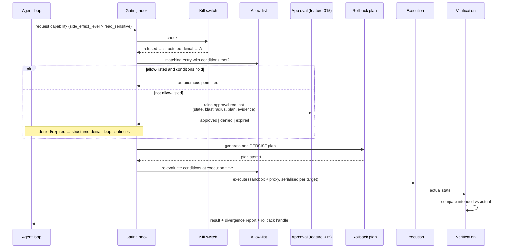

# Plan — 017 Remediation and Rollback

## Summary

Build the execution path for production changes on top of feature 015's approval
machinery: pre-execution rollback plan generation, sandboxed and proxied
execution, post-execution verification, and a conditional autonomy allow-list with
a kill switch above it.

## Technical context

| Aspect | Choice |
|---|---|
| Gating | `pre_tool_use` hook (feature 004) suspends the loop and raises an approval |
| Approval | Feature 015's state machine, with a remediation-specific expiry |
| Rollback | Per-capability generator producing a declarative plan, persisted before execution |
| Execution | Sandbox profile (feature 009) via the credential proxy (feature 007) |
| Verification | Post-execution state read compared against the intended state |
| Blast radius | Topology graph query (feature 012) at request time |
| Serialisation | Per-target advisory lock preventing concurrent conflicting actions |

## Constitution check

| Article | Satisfaction |
|---|---|
| I | The approval request carries the evidence that motivated the action; verification produces evidence of the result |
| II | Approval expiry, rollback window, rate limits, blast-radius ceilings are named constants |
| III | **This is the feature.** Every clause of Article III is implemented here |
| IV | Execution runs through the credential proxy; no capability holds a credential |
| V | Gating is at the runtime hook, so it applies under any runtime |
| VI | No provider coupling |
| VII | N/A |
| VIII | `platform/remediation/` tier 3; capabilities in tier 2 |
| IX | FR-001 — no capability without a declared side-effect level |
| X | Actions touch only the operator's own infrastructure |
| XI | Plans and records persist through `ApprovalStore` and `RunTraceStore` |
| XII | The no-unapproved-write test (SC-001) is written before the execution path |
| XIII | Provenance headers |

**Violations:** none.

## Project structure

```
platform/remediation/
├── models.py            # RemediationAction, RollbackPlan, ExecutionRecord, StateSnapshot
├── gating.py            # pre_tool_use binding: classify, suspend, request
├── request.py           # build the approval request with state, blast radius, plan
├── rollback/
│   ├── generator.py     # per-capability plan generation dispatch
│   ├── executor.py      # apply a recorded plan
│   └── verification.py  # plan-target state match check
├── execution.py         # sandboxed, proxied, serialised execution
├── verification.py      # post-execution intended vs actual
├── autonomy/
│   ├── allow_list.py    # entries and conditions
│   ├── evaluation.py    # condition re-evaluation at execution time
│   └── kill_switch.py   # immediate write refusal
└── audit.py

capabilities/tools/remediation/
├── restart_workload/       rollback_deployment/    scale_workload/
├── cordon_drain_node/      update_resource_limits/ toggle_feature_flag/
└── clear_cache/
```

Each capability package provides four components (FR-025): `read_state.py`,
`apply.py`, `rollback.py`, `verify.py`.

## The gated execution flow



The ordering is the specification: kill switch, then allow-list, then approval,
then **plan persisted**, then re-evaluation, then execution.

## Remediation capability set (FR-024)

| Capability | Level | Rollback |
|---|---|---|
| `restart_workload` | `write_reversible` | None needed; records prior pod identities for verification |
| `rollback_deployment` | `write_reversible` | Roll forward to the prior revision |
| `scale_workload` | `write_reversible` | Restore the prior replica count |
| `cordon_drain_node` | `write_reversible` | Uncordon; drained pods reschedule |
| `update_resource_limits` | `write_reversible` | Restore prior limits |
| `toggle_feature_flag` | `write_reversible` | Restore prior flag value |
| `clear_cache` | `write_irreversible` | None derivable — requires explicit waiver (FR-011) |

`clear_cache` is included deliberately as the case that exercises the
no-rollback-plan path.

## Autonomy conditions (FR-020)

| Condition | Example |
|---|---|
| Target pattern | Only workloads matching `staging-*` |
| Time window | Only outside business hours |
| Maximum blast radius | Only when fewer than N downstream services depend on the target |
| Rate limit | At most three per hour per team |
| Environment | Never in the environment tagged `production` |

Conditions are re-evaluated at execution time (FR-021, SC-006), because a blast
radius computed at request time can change while an approval is pending.

## Implementation phases

### Phase 1 — Gating proofs (test-first)
No-unapproved-write test through every entry point (SC-001), kill-switch
immediacy (SC-003), condition re-evaluation (SC-006). All red.

### Phase 2 — Classification and gating
`pre_tool_use` binding, level-to-policy mapping, loop suspension, structured
denial on refusal with the investigation continuing (SC-008).

### Phase 3 — Request construction
Current-state reading, blast-radius query, rollback-plan generation, evidence
attachment, remediation-specific approval expiry.

### Phase 4 — Rollback
Per-capability generators, pre-execution persistence (SC-002), plan executor,
target-state match verification with refusal on mismatch (SC-007).

### Phase 5 — Execution and verification
Sandboxed proxied execution, per-target serialisation, partial-success recording
with a plan covering only what changed (SC-005), post-execution verification
detecting divergence (SC-004).

### Phase 6 — Autonomy
Allow-list entries and conditions, execution-time re-evaluation, kill switch,
autonomous-execution auditing and team notification.

### Phase 7 — Capability set
The seven remediation capabilities, each with its four components and contract
tests.

## Complexity tracking

| Item | Justification |
|---|---|
| Rollback plan persisted before execution | The ordering is the whole control. A plan generated after execution is a description of what happened, not a reversal the approver evaluated. |
| Condition re-evaluation at execution time | An approval can sit pending while the system changes. A blast radius that was two services at request time may be twenty at execution time. Re-evaluation is what makes the condition meaningful. |
| Post-execution verification | Without it, "the API returned 200" is mistaken for "the change took effect". Divergence detection turns a silent partial failure into a reported one. |
| Kill switch above everything | During a bad incident, the ability to stop all automated writes in one action, without unwinding allow-lists or cancelling approvals individually, is what makes autonomy safe to enable at all. |
| Including `clear_cache` with no derivable rollback | Deliberately exercises FR-011's waiver path in the shipped set, so the path is tested rather than theoretical. |

## Provenance

| Adopted from | Upstream path | Disposition |
|---|---|---|
| Tracer | `core/tool_framework/metadata.py` — `SideEffectLevel`, `requires_approval`, `approval_reason`, `approval_expiry_seconds` | ADOPT (via feature 003) |
| Tracer | `gateway/runtime/approvals.py`, `gateway/{slack,discord}/approvals.py` | ADAPT (via feature 015) |
| Swapnil | `config_service/src/api/routes/remediation.py` + console review/rollback flow | ADAPT → `platform/remediation/` |
| Swapnil | `.claude/skills/remediation/scripts/{restart_pod,rollback_deployment,scale_deployment}.py` | ADAPT → typed capabilities with the four-component structure |
| Swapnil | Remediation rollback endpoint | ADAPT → `rollback/executor.py` |
| Swapnil | `runtime-config-flagd` skill | ADAPT → `toggle_feature_flag` capability |

## Risks

| Risk | Mitigation |
|---|---|
| An approved action applies to a system that has since changed | Condition and state re-evaluation at execution time; post-execution verification reports divergence |
| Approval fatigue leads to reflexive approval | Requests carry blast radius and rollback plan, so the decision is informed rather than uniform; allow-lists remove friction for genuinely low-risk actions |
| Autonomy enabled too broadly | Conditions are conjunctive and re-evaluated; rate limits bound the damage; the kill switch stops everything instantly; every autonomous execution notifies the team |
| Rollback fails and leaves an inconsistent state | Verification refuses to apply a plan against a mismatched target (FR-014); failures report loudly rather than retrying automatically |
| A partially-executed action leaves an incorrect rollback plan | Per-sub-target recording with the plan scoped to what actually changed (FR-016, SC-005) |
