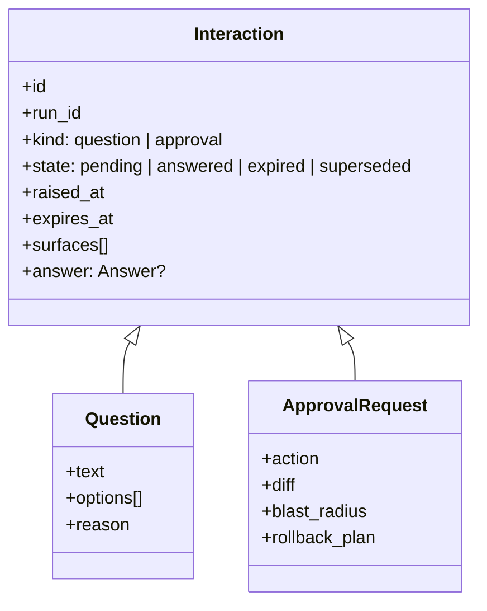
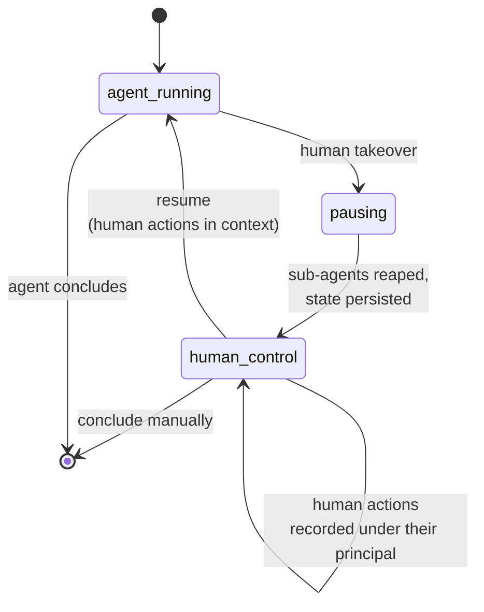

# Plan — 018 Human in the Loop

## Summary

Unify agent-raised questions and approval requests under one `Interaction`
abstraction so cross-surface closure, persistence, and attention state are
implemented once. Build the mid-run message queue, the takeover path, and progress
notification on top of the runtime hooks from feature 004.

## Technical context

| Aspect | Choice |
|---|---|
| Interaction model | One supertype covering questions and approvals; surfaces render, the core owns state |
| Closure | A decision event published to all surfaces, same mechanism as feature 015 |
| Concurrency | First-writer-wins via a conditional state transition; the loser is informed |
| Message queue | `asyncio.Queue` with a debounce window, drained at `on_turn_end` |
| Takeover | Loop pause with sub-agent reaping, then human actions recorded against the same run |
| Persistence | Pending interactions stored with the session so they survive restart |
| Progress | Emitted on a timer with cooldown via the notification sinks (feature 023) |

## Constitution check

| Article | Satisfaction |
|---|---|
| I | Answers and human actions are recorded in the trace with principal attribution |
| II | Question timeout, debounce window, progress interval, cooldown are named constants |
| III | Approvals share this machinery, so the gating path and the question path close identically |
| IV | FR-006 — the agent cannot ask for a secret; refused at the capability boundary |
| V | Built on runtime hooks, so behaviour is identical under any runtime |
| VI | No provider coupling |
| VII | N/A |
| VIII | `core/agent/interaction/` tier 3; surface rendering in tier 1 |
| IX | The handoff capability is declared with metadata like any other |
| X | Interactions travel only to the operator's configured surfaces |
| XI | Pending interactions persist through the session store |
| XII | Cross-surface closure and concurrency tests written first |
| XIII | Provenance headers |

**Violations:** none.

## Project structure

```
core/agent/interaction/
├── models.py            # Interaction, Question, Answer, AttentionState
├── registry.py          # pending interactions per run
├── closure.py           # cross-surface propagation, first-writer-wins
├── persistence.py       # survive session restart
└── attention.py         # run-listing attention state

core/agent/handoff.py    # the ask-a-human capability (extends feature 004)
core/agent/message_queue.py   # debounce + merge (extends feature 004)
core/agent/takeover.py   # pause, human interval, resume

capabilities/tools/system/ask_human/
└── tool.py              # declared capability with secret-request refusal
```

## The Interaction abstraction



Unifying these is the point: cross-surface closure (FR-015), persistence (FR-017),
concurrency resolution (FR-016), and attention state (FR-020) are each implemented
once rather than twice, so a question and an approval never behave differently in
the same Slack thread.

## Message merge (FR-008)

```
Turn N executing
  ├─ human sends "check the deploy at 14:32"
  ├─ human sends "also the cache cluster"       } within debounce window
  └─ human sends "ignore the DB, we ruled it out"
Turn N ends → drain and merge:

  Additional guidance from the operator:
  1. check the deploy at 14:32
  2. also the cache cluster
  3. ignore the DB, we ruled it out

Turn N+1 begins with the block in context; message_queued event emitted.
```

Numbering preserves ordering, which matters because later messages often correct
earlier ones.

## Takeover flow



The trace remains one record across the whole sequence (FR-012), so the incident's
handling reads as a single story rather than two disconnected halves.

## Implementation phases

### Phase 1 — Interaction contracts (test-first)
Unified model, cross-surface closure test (SC-001), concurrency test (SC-002),
persistence test (SC-007), secret-refusal test (SC-005). All red.

### Phase 2 — Questions
Handoff capability with structured options, timeout with structured no-answer,
guardrail filtering of answers, principal attribution, secret-request refusal.

### Phase 3 — Closure and concurrency
Decision-event propagation, first-writer-wins transition, informing the loser,
persistence across restart.

### Phase 4 — Message queue
Debounce, merge into a numbered guidance block, `message_queued` event, the
final-turn guard preventing tool reintroduction.

### Phase 5 — Takeover
Pause with sub-agent reaping, human-action recording under the human principal,
resume with actions in context.

### Phase 6 — Attention and progress
Attention state in run listings, progress notification on a timer with cooldown.

### Phase 7 — Approval unification
Migrate feature 015's approval requests onto the `Interaction` abstraction so both
share closure, persistence, and attention.

## Complexity tracking

| Item | Justification |
|---|---|
| Unifying questions and approvals | Both are "the run is waiting on a human, across N surfaces, with a timeout". Implementing them separately guarantees they diverge — one gets persistence, the other does not; one closes cross-surface, the other leaves a stale button in Slack. |
| Takeover as distinct from cancellation | Cancelling and manually fixing produces two disconnected records of one incident. Takeover keeps a single trace, which is what makes the incident reviewable and the episode useful to memory. |
| Refusing secret-requesting questions | An easy path for the agent to defeat Article IV is simply to ask. Refusing at the capability boundary closes it. |
| Debounce and merge rather than immediate delivery | Immediate delivery means either interrupting a model call or inconsistent ordering. Turn-boundary merge is deterministic and preserves the human's sequence. |

## Provenance

| Adopted from | Upstream path | Disposition |
|---|---|---|
| Swapnil | `AskUserQuestion` SDK pattern and `question` SSE event | ADAPT → `handoff.py`, `ask_human` capability |
| Swapnil | `sre-agent/message_queue.py` | ADAPT (via feature 004) |
| Swapnil | Mid-run `queue-message` endpoint and `message_queued` event | ADOPT |
| Swapnil | `sre-agent/server.py` interrupt endpoint | ADAPT → `takeover.py` |
| Tracer | `gateway/runtime/attention.py` | ADOPT → `attention.py` |
| Tracer | `gateway/runtime/approvals.py` cross-surface handling | ADAPT → `closure.py` |
| Tracer | Interactive-shell cancellation semantics | REFERENCE → informs the takeover pause path |

## Risks

| Risk | Mitigation |
|---|---|
| Stale approval or question buttons on a surface after answering elsewhere | Single closure event all surfaces subscribe to (SC-001), with a propagation budget the test asserts |
| An investigation blocks indefinitely on an unanswered question | Timeout with a structured no-answer result (FR-003, SC-003); the run always reaches a conclusion |
| Takeover leaves orphaned sub-agent work | Explicit reaping in the pause path (FR-014), verified by SC-006 |
| Humans spam context and destabilise reasoning | Debounce and merge (FR-008) plus turn-boundary injection means guidance arrives coherently rather than mid-thought |
| Progress notifications become noise | Cooldown (FR-019, SC-008) and attention state (FR-020) so people check when it matters rather than being told repeatedly |
