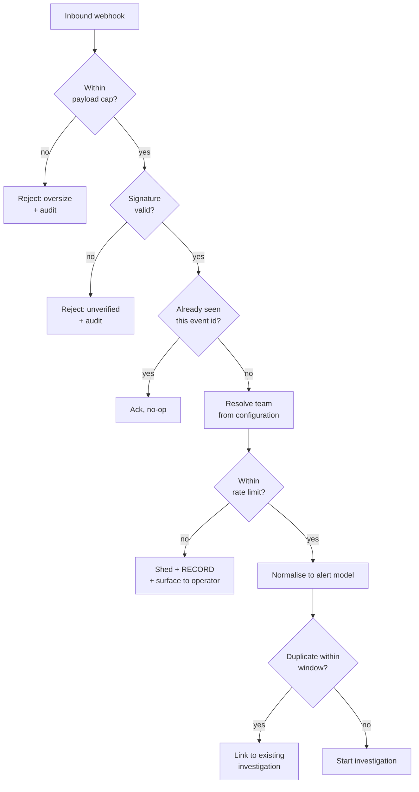

# Plan — 020 REST API and Alert Ingestion

## Summary

Build the HTTP surface in `gateway/http/`: versioned REST routes with
boundary-checked permissions, SSE streaming with cursor-based reconnection, and
per-source webhook ingestion with verification, normalisation, deduplication, and
explicit load shedding.

## Technical context

| Aspect | Choice |
|---|---|
| Framework | FastAPI with an async ASGI server |
| Auth | Bearer tokens and session cookies via feature 014 dependencies |
| Streaming | SSE with cursor-based catch-up over feature 016's event log |
| Verification | Per-source: HMAC signature, shared secret, or mTLS |
| Normalisation | Per-source adapters from feature 005's `core/domain/alerts/` |
| Deduplication | Fingerprint over source, alert identity, and target, within a time window |
| Load shedding | Token bucket per source and team; shed decisions recorded |
| OpenAPI | Generated from route models and served |

## Constitution check

| Article | Satisfaction |
|---|---|
| I | Correlation identifiers propagate into the trace; ingestion records are evidence of what arrived |
| II | Rate limits, payload caps, buffer sizes, dedup windows are named constants |
| III | Approval routes present context and record decisions; no route executes a write capability directly |
| IV | FR-004, SC-005 — no exception detail in responses; guardrail sink boundary applies |
| V | The API drives the canonical runtime |
| VI | No provider coupling |
| VII | N/A |
| VIII | `gateway/http/` and `gateway/webhooks/` are tier 1; they never import `surfaces` |
| IX | Capability metadata is exposed read-only for catalogue rendering |
| X | The API listens where the operator deploys it; nothing is transmitted outward |
| XI | Storage reached through ports |
| XII | Signature-forgery, reconnection, and fault-injection tests written first |
| XIII | Provenance headers |

**Violations:** none.

## Project structure

```
gateway/http/
├── app.py                   # FastAPI application, versioning, OpenAPI
├── lifespan.py              # startup checks, graceful shutdown drain
├── routes/
│   ├── investigations.py    threads.py       interactions.py
│   ├── runs.py              config.py        integrations.py
│   ├── memory.py            schedules.py     capabilities.py
│   └── health.py
├── streaming/
│   ├── sse.py               # event serialisation, heartbeats
│   ├── subscription.py      # cursor handling, catch-up
│   └── backpressure.py      # bounded buffer, stalled-consumer disconnect
├── errors.py                # sanitised error responses
└── rate_limit.py

gateway/webhooks/
├── router.py                # endpoint, team routing
├── verification/
│   ├── hmac.py  shared_secret.py  mtls.py
├── sources/
│   ├── alertmanager.py  pagerduty.py  datadog.py
│   ├── grafana.py       sentry.py     opsgenie.py
│   └── generic.py
├── dedup.py                 # fingerprint + window, linking not discarding
├── shedding.py              # explicit load shed with recording
└── idempotency.py           # source event-id based
```

## Webhook flow



The `SHED` node is deliberately explicit (FR-020): what is not investigated must be
visible to the operator.

## SSE contract

| Aspect | Behaviour |
|---|---|
| Event shape | Feature 005's typed events, serialised identically for every surface |
| Cursor | Monotonic per run; the client sends `Last-Event-ID` on reconnect |
| Catch-up | Read from the event log after the cursor, then attach live |
| Heartbeat | Comment frames at a fixed interval to survive proxies |
| Backpressure | Bounded per-subscriber buffer; overflow disconnects the subscriber, never blocks the run |

## Deduplication (FR-018)

Fingerprint components: source, source-provided alert identity where available,
normalised target (service, resource), and alert name. Within
`ALERT_DEDUP_WINDOW_SECONDS`, a matching alert is **linked** to the existing
investigation and recorded — never discarded, so the operator can split a
mis-grouped pair.

## Implementation phases

### Phase 1 — Contracts (test-first)
Route permission declarations, error-sanitisation fault-injection test (SC-005),
cross-team access test (SC-006), signature-forgery tests (SC-003). All red.

### Phase 2 — API core
FastAPI application, versioning, OpenAPI generation, auth dependencies, error
handling, rate limiting, correlation propagation.

### Phase 3 — Investigation routes
Create, get, list, cancel; threads and turns; mid-run message queue; interactions
list, answer, approve, reject.

### Phase 4 — Streaming
SSE serialisation, cursor subscription with catch-up, heartbeats, backpressure with
stalled-consumer disconnect.

### Phase 5 — Remaining routes
Runs and replay, configuration, integrations, memory, schedules, capabilities,
health and readiness.

### Phase 6 — Webhook ingestion
Endpoint with team routing, three verification mechanisms, seven source adapters,
idempotency, payload caps.

### Phase 7 — Storm handling and lifecycle
Deduplication with linking, explicit load shedding with recording and surfacing,
graceful shutdown drain, storm validation (SC-004).

## Complexity tracking

| Item | Justification |
|---|---|
| Seven webhook source adapters | Each vendor's payload and verification differ materially. A generic adapter would either lose fields the pipeline needs or force operators to write transformation glue. |
| Three verification mechanisms | Vendors do not agree: some HMAC, some shared secret, some support mTLS. Supporting only one would exclude sources. |
| Explicit load-shed recording | Costs storage and a reporting surface. Buys the property that an operator can always answer "what did it not look at?" — which is the first question after a bad storm. |
| Linking rather than discarding duplicates | Slightly more storage and a linking model, versus the risk of silently swallowing a genuinely distinct second incident. |

## Provenance

| Adopted from | Upstream path | Disposition |
|---|---|---|
| Swapnil | `sre-agent/server_simple.py` FastAPI routes and SSE | ADAPT → `gateway/http/` |
| Swapnil | `sre-agent/events.py` | ADOPT (via feature 005) |
| Swapnil | `POST /threads/{id}/queue-message` | ADOPT |
| Swapnil | Interrupt endpoint | ADAPT → cancel and takeover routes |
| Swapnil | `web_ui/src/app/api/` route shapes | REFERENCE — informs resource design |
| Tracer | `gateway/http/{webapp,web_server,worker,investigations}.py` | ADAPT |
| Tracer | `integrations/alertmanager/`, `pagerduty/`, `incident_io/` payload handling | ADAPT → source adapters |
| Tracer | `core/domain/alerts/normalization.py` | ADOPT (via feature 005) |
| Tracer | External-surface error redaction | ADOPT → `errors.py` |

## Risks

| Risk | Mitigation |
|---|---|
| An alert storm exhausts capacity | Rate limiting with explicit shedding (FR-020) plus scheduler concurrency limits; SC-004 validates at 1,000 events per minute |
| Deduplication merges distinct incidents | Linking rather than discarding, with the linked alert fully recorded so an operator can split it |
| A stalled SSE consumer stalls a run | Bounded buffer with disconnect (FR-012, SC-007); the run never waits on a subscriber |
| Signature verification misimplemented for a vendor | Per-source forgery tests (SC-003) with real payload fixtures |
| Error responses leak internals | Fault injection across every route (SC-005), on top of the guardrail sink boundary from feature 008 |
