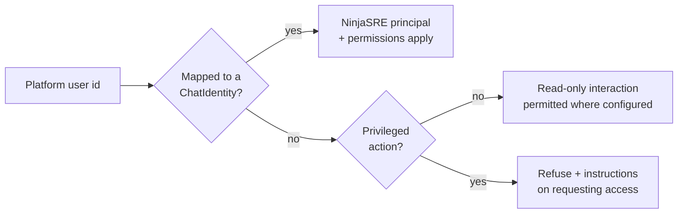

# Plan — 022 Chat Surfaces

## Summary

One chat abstraction with four platform adapters. Adapt Tracer's Slack, Telegram,
and Discord gateways and Swapnil's Teams bot, unifying them behind a shared
contract so a behaviour implemented once works on all four.

## Technical context

| Aspect | Choice |
|---|---|
| Abstraction | `ChatPlatform` port: receive, stream, render interaction, resolve identity |
| Slack | Socket Mode or HTTP events; Block Kit for interactions |
| Teams | Bot Framework; Adaptive Cards |
| Telegram | Bot API long polling or webhook; inline keyboards |
| Discord | Gateway with application commands and message components |
| Streaming | Rate-limited in-place message editing, per-platform limits |
| Identity | Platform user id → `ChatIdentity` → NinjaSRE principal |
| Transport to core | Feature 020's REST + SSE, same as every other surface |

## Constitution check

| Article | Satisfaction |
|---|---|
| I | Reports carry evidence; the thread links to the full trace in the console |
| II | Streaming update rate, message size limits, backoff are named constants |
| III | FR-001, FR-007 — approvals render with full context and close across surfaces |
| IV | FR-008, SC-006 — no exception detail in chat; guardrails filter thread history in |
| V | Chat drives the canonical runtime via the API |
| VI | No provider coupling |
| VII | N/A |
| VIII | `gateway/{slack,teams,telegram,discord}/` tier 1; never import `surfaces` |
| IX | Slash and application commands are generated from a shared catalogue |
| X | Bots connect only to the operator's own workspaces |
| XI | No direct storage access |
| XII | The four-platform contract suite is written before the adapters |
| XIII | Provenance headers |

**Violations:** none.

## Project structure

```
gateway/chat/
├── port.py                  # ChatPlatform protocol
├── contract.py              # shared behaviour all adapters must satisfy
├── streaming.py             # rate-limited in-place editing
├── identity.py              # chat identity → principal mapping
├── routing.py               # channel → team, alert-source settings
├── history.py               # thread history ingestion with guardrail filtering
├── chunking.py              # message-limit splitting and attachment
└── commands.py              # shared command catalogue

gateway/slack/       events.py client.py output_sink.py interactions.py
                     socket_mode.py identity.py intro.py
gateway/teams/       app.py bot_handlers.py cards.py stream_handler.py identity.py
gateway/telegram/    client.py events.py keyboards.py output_sink.py
gateway/discord/     client.py events.py components.py output_sink.py worker.py

tests/contract/chat/         # one suite, four platforms
```

## The shared contract (SC-001)

Every adapter must satisfy the same suite:

| Behaviour | Assertion |
|---|---|
| Start by mention or command | An investigation begins bound to a thread |
| Stream progress | Updates edit in place within rate limits |
| Deliver report | Complete content, split or attached if oversized |
| Render approval | Target, change, blast radius, rollback plan all present |
| Resolve interaction | Decision reaches the core and closes elsewhere |
| Add mid-run context | Message becomes queued guidance |
| Map identity | Platform user resolves to a principal, or is refused |
| Refuse unmapped | Privileged action denied with instructions |
| Sanitise errors | No exception detail in any message |
| Survive disconnect | Run continues; report delivered on reconnect |

Implementing a behaviour means implementing it in `gateway/chat/` and wiring four
thin adapters — not writing it four times.

## Streaming discipline (FR-004, FR-009)

Chat platforms punish per-event posting with rate limits and unreadable threads.
Instead:

1. Post one progress message when the investigation starts.
2. Edit it in place at a bounded interval, showing the current stage, capabilities
   called, and elapsed time.
3. Post the final report as a separate message so it is quotable and linkable.
4. On rate limit, back off and coalesce — never drop content.

## Identity mapping (FR-002, FR-003)



Auto-provisioning is deliberately absent: anyone in a workspace could otherwise
become a principal.

## Implementation phases

### Phase 1 — Contract and abstraction (test-first)
`port.py`, the four-platform contract suite, identity-refusal test, error-
sanitisation fault injection. All red.

### Phase 2 — Shared behaviour
Streaming with rate-limited in-place editing, message chunking, identity mapping,
channel routing, thread-history ingestion with guardrail filtering, command
catalogue.

### Phase 3 — Slack
Socket Mode and HTTP events, Block Kit interactions, slash commands, channel
introduction.

### Phase 4 — Microsoft Teams
Bot Framework wiring, Adaptive Cards for reports, approvals, and questions, Teams
auth for identity mapping.

### Phase 5 — Telegram
Bot API with polling or webhook, inline keyboards, group and direct chats.

### Phase 6 — Discord
Gateway connection, application commands, message components, guild threads.

### Phase 7 — Resilience and verification
Reconnection handling with report fallback, concurrent-approval resolution,
200-event streaming validation, per-platform setup documentation.

## Complexity tracking

| Item | Justification |
|---|---|
| Four platforms | Each upstream covered a different subset, and enterprises are split across them. The shared contract means the marginal cost per platform is an adapter, not a reimplementation. |
| In-place editing rather than per-event posting | Costs edit-rate management; buys a readable thread and staying inside rate limits. Per-event posting makes the bot unusable in a busy channel. |
| No identity auto-provisioning | Adds an onboarding step; prevents anyone in a workspace from acquiring a principal by typing a message. |
| Thread history as input | A prompt-injection surface, mitigated by treating it as data and passing it through guardrails. The value — the agent seeing what humans already established — is high enough to justify the control rather than the omission. |

## Provenance

| Adopted from | Upstream path | Disposition |
|---|---|---|
| Tracer | `gateway/slack/` (events, client, output_sink, approvals, feedback, thread_history, socket_mode_worker, channel_intro, security) | ADAPT |
| Tracer | `gateway/telegram/` | ADAPT |
| Tracer | `gateway/discord/` (worker, dispatcher, components, approvals, background) | ADAPT |
| Tracer | `gateway/attachments/inline.py` | ADAPT → `chunking.py` |
| Tracer | `gateway/runtime/live_sink.py`, `status_messages.py` | ADAPT → `streaming.py` |
| Tracer | `gateway/{slack,discord}/principal.py` | ADAPT → `identity.py` |
| Swapnil | `teams-bot/` (app, bot_handlers, card_builder, stream_handler, progress_text, tool_display) | ADAPT → `gateway/teams/` |
| Swapnil | Slack Socket Mode bot | REFERENCE — Tracer's is more complete |

## Risks

| Risk | Mitigation |
|---|---|
| Platform API changes break an adapter | The contract suite runs per platform against recorded fixtures, so a breaking change surfaces in CI |
| Rate limits cause dropped updates | Backoff with coalescing, never dropping (FR-009); SC-003 validates a 200-event run |
| Prompt injection via thread history | Treated as data, guardrail-filtered (FR-006); the agent's instructions come only from its system prompt and operator configuration |
| Approval buttons go stale after a decision elsewhere | Cross-surface closure from feature 018 (SC-002) with a propagation budget |
| A platform outage strands an investigation | The run continues (FR-010, SC-007); the report is delivered on reconnect or via a fallback notification sink |
