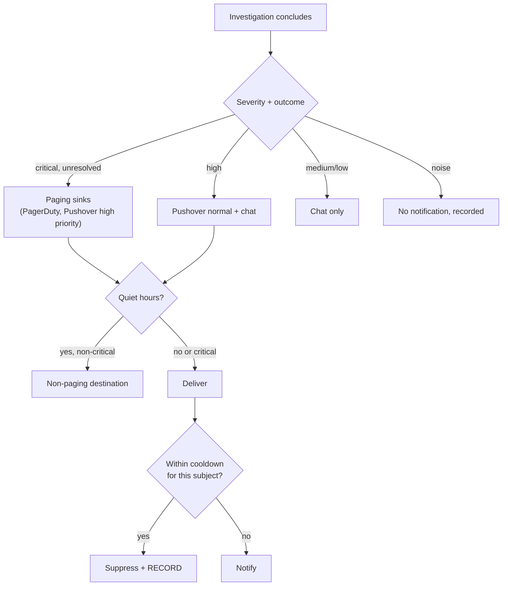

# Plan — 023 Notifications and Reporting

## Summary

Adopt Tracer's reporting and notification layers — formatters, delivery registry,
cooldown, and sink-level redaction — extend the destination set, and add Pushover
plus escalation with cancellation.

## Technical context

| Aspect | Choice |
|---|---|
| Report model | Structured output from the `diagnose` stage (feature 005) |
| Formatters | Per destination class, registered in a registry |
| Delivery | Per-destination isolation with independent retry and health |
| Idempotency | Delivery key per run and destination, so a retry cannot duplicate |
| Redaction | At the sink, driven by the destination's declared audience |
| Cooldown | Per-subject window over a fingerprint of team, subject, and severity |
| Escalation | Scheduled follow-up cancelled by the underlying item's resolution |

## Constitution check

| Article | Satisfaction |
|---|---|
| I | FR-002, FR-003 — every validated claim references evidence; no-conclusion is stated plainly |
| II | Cooldown windows, rate limits, retry ceilings, escalation delays are named constants |
| III | Reports recommend; they never execute. Approval requests go through feature 018 |
| IV | FR-005, FR-018 — guardrails before delivery, redaction at the sink |
| V | Runtime-agnostic |
| VI | No provider coupling |
| VII | Reports record capabilities used and cost, feeding evaluation |
| VIII | `platform/reporting/` and `platform/notifications/` tier 3; transports in `integrations` |
| IX | Capability usage is reported from metadata |
| X | Delivery goes only where the operator configured |
| XI | Delivery records persist in the trace |
| XII | Idempotency and redaction tests written first |
| XIII | Provenance headers |

**Violations:** none.

## Project structure

```
platform/reporting/
├── models.py              # Report structure
├── builder.py             # diagnosis + evidence → Report
├── formatters/
│   ├── chat.py  ticket.py  document.py  markdown.py  email.py
├── registry.py            # destination class → formatter
├── delivery/
│   ├── dispatcher.py      # per-destination isolation, retry, idempotency
│   ├── health.py          # unhealthy-destination marking
│   └── verification.py    # pre-use destination check
└── sizing.py              # oversized-report summarisation with link

platform/notifications/
├── sinks/
│   ├── pushover.py  email.py  webhook.py  pagerduty.py  chat.py
├── policy.py              # severity, outcome, quiet hours routing
├── cooldown.py            # per-subject suppression with recording
├── limits.py              # per-team rate limits
├── redaction.py           # audience-driven sink redaction
└── escalation.py          # delayed follow-up with cancellation
```

## Report structure (FR-001)

| Section | Content |
|---|---|
| Summary | One paragraph an on-call engineer can act on |
| Root cause | The conclusion, with an explicit confidence level |
| Causal chain | The mechanism, step by step |
| Validated claims | Each with its evidence reference |
| Non-validated claims | Hypotheses the evidence did not confirm |
| Ruled out | What was considered and eliminated, with why |
| Recommended actions | Immediate, short-term, preventive |
| Metadata | Capabilities used, duration, token cost, run link |

The "ruled out" section is what makes a no-conclusion report useful rather than an
apology (FR-002).

## Destination matrix

| Destination | Class | Notes |
|---|---|---|
| Slack, Teams, Telegram, Discord | chat | Rendered by feature 022's adapters |
| Jira, GitHub, GitLab | ticket | Issue or comment with evidence |
| Confluence, Notion, Google Docs | document | Postmortem-shaped page |
| Local Markdown | markdown | `report.md` on disk |
| Email | email | HTML and plain text |
| PagerDuty | ticket | Incident note |

## Notification sinks and policy

| Sink | Use |
|---|---|
| **Pushover** | Direct phone push, independent of chat platforms |
| Email | Non-urgent summaries and digests |
| Webhook | Operator's own automation |
| PagerDuty | Paging for critical outcomes |
| Chat | In-channel notification |

Policy routing:



Suppression is always recorded (FR-016), so an operator can see what they were not
told.

## Escalation (FR-019, FR-020)

An attention item unaddressed after a configured delay escalates to another
destination. The escalation is scheduled and **cancelled** when the item resolves —
so an approval granted at minute nine does not page someone at minute ten.

## Implementation phases

### Phase 1 — Contracts (test-first)
Report model, idempotency test (SC-005), redaction test (SC-006), oversize test
(SC-007), escalation-cancellation test (SC-008). All red.

### Phase 2 — Report building
Builder from diagnosis and evidence, evidence references on validated claims,
explicit no-conclusion path with ruled-out content.

### Phase 3 — Formatters
Chat, ticket, document, Markdown, and email formatters; the registry; oversized
summarisation with link.

### Phase 4 — Delivery
Dispatcher with per-destination isolation, idempotent retry with backoff, health
marking, pre-use verification, trace recording.

### Phase 5 — Notification sinks
Pushover, email, webhook, PagerDuty, chat sinks; audience-driven redaction.

### Phase 6 — Policy
Severity and outcome routing, quiet hours, cooldown with recording, per-team rate
limits.

### Phase 7 — Escalation and verification
Scheduled escalation with cancellation, thirteen-destination rendering validation,
operator documentation.

## Complexity tracking

| Item | Justification |
|---|---|
| Thirteen destinations | Teams already have a place where incident records live. Making them adopt a new one to use this tool is the fastest way to not be used. Formatters are grouped into five classes, so the marginal cost is configuration, not code. |
| Sink-level redaction | One report generation with per-audience redaction is simpler and safer than generating N reports; it also means a change to report content cannot accidentally bypass redaction for one destination. |
| Escalation with cancellation | An escalation that fires after resolution trains people to ignore escalations. Cancellation is what keeps the signal meaningful. |
| Recording every suppression | Costs storage; buys the ability to answer "why wasn't I told?" — which is the question asked after every missed incident. |

## Provenance

| Adopted from | Upstream path | Disposition |
|---|---|---|
| Tracer | `tools/investigation/reporting/formatters/` | ADAPT → `platform/reporting/formatters/` |
| Tracer | `tools/investigation/reporting/renderers/` | ADAPT |
| Tracer | `tools/investigation/reporting/delivery/{bootstrap,dispatch}.py` | ADAPT → `delivery/dispatcher.py` |
| Tracer | `platform/reporting/delivery_registry.py` | ADOPT |
| Tracer | `platform/notifications/{cooldown,limits,redaction,delivery_transport,delivery_errors}.py` | ADOPT |
| Tracer | `tools/investigation/reporting/gitlab_writeback.py` | ADAPT → ticket formatter |
| Tracer | `platform/reporting/slack_reactions.py` | ADAPT |
| Tracer | `integrations/smtp/` | ADAPT → email sink |
| Swapnil | `sre-agent/report.py` | ADAPT |
| Swapnil | Google Docs and Notion skills | ADAPT → document formatters |
| — | Pushover | NEW — `sinks/pushover.py`, no upstream equivalent |

## Risks

| Risk | Mitigation |
|---|---|
| Notification fatigue | Severity routing, cooldown, quiet hours, and per-team rate limits, all recorded so tuning is data-driven rather than guesswork |
| A destination silently stops working | Pre-use verification (FR-022) plus health marking after repeated failures (FR-011), surfaced to the operator |
| Duplicate delivery on retry | Idempotency key per run and destination (FR-010, SC-005) |
| Sensitive content in a report reaching a broad audience | Guardrail filtering before delivery plus audience-driven sink redaction (FR-005, FR-018, SC-006) |
| Oversized reports truncated at a destination | Summarisation with a link to the full version (FR-007, SC-007) |
