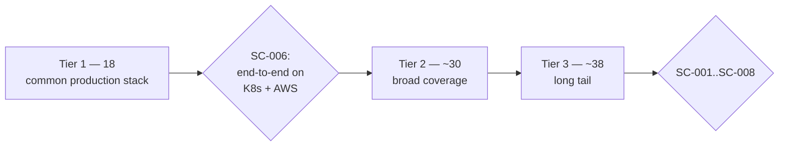

# Plan — 025 Integration Catalogue Parity

## Summary

Deliver 86 integrations at full parity in three tiers, harvesting Tracer's clients
and Swapnil's methodology content, using feature 024's scaffold, templates, and
contract suite. Work is parallelisable by integration once the framework is stable.

## Technical context

| Aspect | Choice |
|---|---|
| Per-integration work | Scaffold → schema → client methods → capabilities → skill specialisation → docs → scenario |
| Harvesting | Tracer clients as the base; Swapnil SKILL.md content as methodology input |
| Scenarios | Recorded live responses, hand-annotated with an answer key |
| Verification | Live where maintainers hold credentials; explicitly unverified otherwise |
| Parallelism | After tier 1, integrations are independent and can proceed concurrently |

## Constitution check

| Article | Satisfaction |
|---|---|
| I | Every capability returns structured evidence with source attribution |
| II | Time windows, result caps, pagination limits are named constants per FR-005 |
| III | FR-007, SC-004 — every write declares its level and supplies a rollback generator |
| IV | SC-003 — no client reads a credential, catalogue-wide |
| V | Runtime-agnostic |
| VI | No provider coupling |
| VII | Per-integration scenarios feed the evaluation corpus |
| VIII | `integrations/` tier 2 throughout |
| IX | FR-004 — capabilities model investigative purpose, not raw API surface |
| X | Each integration reaches only its allow-listed hosts |
| XI | No storage access from integrations |
| XII | Every integration ships with a scenario before it is considered done |
| XIII | Provenance headers on all harvested code |

**Violations:** none.

## Harvesting strategy

| Source | What is taken | Into |
|---|---|---|
| Tracer `integrations/<vendor>/client.py` | Endpoint knowledge, response parsing, quirks | `client.py` on the new base |
| Tracer `integrations/<vendor>/verifier.py` | Verification approach | `verifier.py` |
| Tracer `integrations/<vendor>/tools/` | Capability decomposition | `tools/` |
| Swapnil `.claude/skills/<vendor>/SKILL.md` | Methodology, query syntax, anti-patterns, flowcharts | skill body |
| Swapnil `.claude/skills/<vendor>/scripts/` | Endpoint knowledge where Tracer lacks the vendor | `client.py` |

Where both cover a vendor, Tracer's client is the base and Swapnil's methodology
becomes the skill — the union is better than either.

## Per-integration checklist

1. `scaffold_integration --vendor X --domain Y`
2. Credential schema and vault mapping
3. Client methods on `_base/client.py`, proxy-routed
4. Verifier with permission enumeration
5. Capabilities: bounded reads, statistics-first variants where payloads are large,
   correct `side_effect_level`, rollback generators for writes
6. Skill specialising the domain template with vendor query syntax, gotchas,
   anti-patterns
7. `docs.md`: credentials, minimum permissions, setup, regions, rate limits,
   limitations
8. Synthetic scenario from recorded responses with an answer key
9. Contract suite green
10. Live verification where credentials are available

## Delivery sequence

The tier-1 gate (SC-006) is deliberate: it proves the framework and the harvesting
approach on a real stack before committing the remaining ~68 integrations to it.

## Capability design rules (FR-004, FR-005, FR-006)

| Rule | Example |
|---|---|
| Model purpose, not endpoints | `get_log_statistics` rather than `post_logs_search` |
| Bound every read | Time window required; result cap enforced; pagination limited |
| Statistics before samples | `get_statistics` alongside `sample_logs`, with the skill directing statistics first |
| Statistics-first for large payloads | Any capability that could return megabytes has a summarising sibling |
| Correct side-effect level | A capability that acknowledges an alert is `write_reversible`, not `read` |

## Implementation phases

### Phase 1 — Tier 1 (18 integrations)
Kubernetes and the AWS family first (they exercise proxy-side signing), then
Grafana/Loki/Prometheus, Datadog, Elasticsearch, PagerDuty, Slack, GitHub, Jira,
PostgreSQL, Sentry, Alertmanager.

### Phase 2 — Tier 1 gate
End-to-end investigation on a Kubernetes and AWS stack using only tier-1
integrations (SC-006). Adjust the framework if the harvesting approach proved
weaker than expected.

### Phase 3 — Tier 2, observability and cloud
Remaining observability vendors, GCP, Azure, ArgoCD, Jenkins.

### Phase 4 — Tier 2, data and version control
MySQL, Redis, Kafka, GitLab, Opsgenie, Teams, Confluence.

### Phase 5 — Tier 3, databases and data platform
Remaining databases and the data-platform group.

### Phase 6 — Tier 3, project, communication, analytics
Remaining ticketing, docs, communication, and analytics vendors.

### Phase 7 — Catalogue completion
Documentation generation for all 86, live verification where credentials exist,
explicit unverified marking elsewhere, full contract and scenario runs.

## Complexity tracking

| Item | Justification |
|---|---|
| 86 integrations in the MVP | ADR 0009. Coverage is the adoption gate; a missing integration ends an evaluation regardless of reasoning quality. |
| A synthetic scenario per integration | 86 scenarios is significant work and is what prevents the catalogue from rotting: a framework change is validated against every vendor at once. |
| Statistics-first variants | Duplicates some capability surface per vendor. Prevents the single most common failure mode in log investigation — dumping raw data into context and exhausting the budget. |
| Tier gating before the long tail | Costs a checkpoint; avoids discovering a framework flaw after 60 integrations were built on it. |

## Provenance

| Adopted from | Upstream path | Disposition |
|---|---|---|
| Tracer | `integrations/` × 76 vendors | ADAPT — clients, verifiers, capability decomposition |
| Tracer | `integrations/hermes/` | ADAPT — log tailing and classification |
| Swapnil | `.claude/skills/` × 51 vendors | ADAPT — methodology into skills |
| Swapnil | `.claude/skills/*/scripts/` × ~250 | ADAPT — endpoint knowledge where Tracer lacks the vendor |
| Swapnil | `observability-*` statistics-first discipline | ADOPT — becomes a design rule for every log and metric integration |
| Swapnil | `infrastructure-kubernetes` events-before-logs discipline | ADOPT |
| — | Pushover, Twilio, Rocket.Chat, WhatsApp | NEW or minimally-derived |

## Risks

| Risk | Mitigation |
|---|---|
| The wave takes longer than planned | Tier ordering means the platform is useful after tier 1; the tier gate re-estimates on real data |
| Quality varies across 86 integrations | Enforced mechanically: contract suite, domain templates, mandatory scenario. Consistency does not depend on review attention |
| Vendor API drift during the wave | Scheduled live runs with degraded marking (feature 024); drift is visible within a day |
| Maintainers lack credentials for some vendors | Explicitly marked unverified (SC-008) rather than assumed working — an honest gap |
| Overlapping vendors produce redundant work | Domain templates and the shared base mean the second vendor in a domain is materially cheaper than the first |
