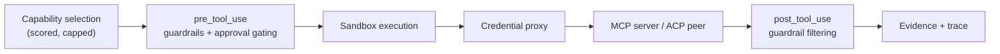
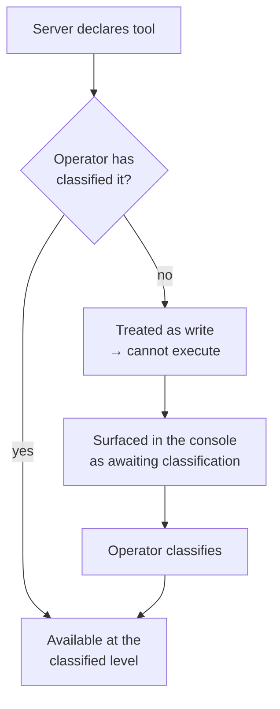

# Plan — 026 Protocol Bridges

## Summary

Adapt Tracer's MCP bridge and OpenClaw integration into a general protocol-bridge
port, add ACP, and expose a read-and-investigate MCP server. The governing
principle throughout: a bridged capability is subject to every control a native
capability is, and its self-declared safety is never trusted.

## Technical context

| Aspect | Choice |
|---|---|
| Bridge port | `ProtocolAdapter`: discover, describe, invoke, health |
| MCP transports | stdio and HTTP |
| Namespacing | `<server>.<tool>` so collisions are structurally impossible |
| Classification | Operator-assigned, stored in team configuration, required before execution |
| Schema handling | Normalised through feature 002; unnormalisable tools excluded with a reason |
| Server auth | Vault credentials via the credential proxy |
| Our MCP server | Read and investigate only; token-scoped; fully audited |

## Constitution check

| Article | Satisfaction |
|---|---|
| I | Bridged invocations are traced identically to native ones (FR-011, SC-003) |
| II | Tool caps, timeouts, and result limits are named constants |
| III | FR-003 — unclassified means write; operator classification required before execution |
| IV | FR-006 — server credentials come from the vault via the proxy, never the agent |
| V | Bridges are runtime-agnostic |
| VI | FR-004 — schemas normalise per provider, so a bridged tool works on all nine |
| VII | Bridged capability usage feeds effectiveness scoring like any other |
| VIII | `capabilities/protocols/` tier 2 |
| IX | **Central.** Bridged tools enter the same declared catalogue under the same rules |
| X | Servers are the operator's own or ones they chose; the MCP server listens where they deploy it |
| XI | No direct storage access from bridges |
| XII | The unclassified-cannot-execute and parity-of-controls tests are written first |
| XIII | Provenance headers |

**Violations:** none.

## Project structure

```
capabilities/protocols/
├── port.py                # ProtocolAdapter protocol
├── classification.py      # operator-assigned side-effect levels for bridged tools
├── registration.py        # server registration, refresh, health
├── namespacing.py         # <server>.<tool>
├── mcp/
│   ├── client.py          # stdio and HTTP transports
│   ├── discovery.py       # tool listing → BridgedCapability
│   ├── invocation.py      # call with timeout, guardrails, trace
│   └── schema.py          # normalisation and exclusion of unnormalisable tools
├── acp/
│   └── adapter.py
├── openclaw/
│   └── adapter.py
└── server/
    ├── app.py             # NinjaSRE as an MCP server
    ├── surface.py         # the exposed operations
    └── auth.py            # token scope enforcement
```

## Governance parity (FR-011, SC-003)

A bridged capability passes through exactly the same path as a native one:



SC-003 verifies this by comparing the controls and trace of a bridged invocation
against a native one — parity is asserted, not assumed.

## Classification flow (FR-003)



The server's own declaration is used as a **suggestion** shown to the operator, and
never as the effective classification. A third-party server declaring its
`delete_everything` tool as read-only must not be able to make it so.

## NinjaSRE's MCP server surface (FR-014, FR-016)

| Exposed | Not exposed |
|---|---|
| Start an investigation | Configuration writes |
| Read investigation status and result | Credential access of any kind |
| Search episodic memory | Remediation execution |
| Query service topology | Identity or token management |
| Read the capability catalogue | Approval decisions |

Read-and-investigate only. A composing agent may ask NinjaSRE what is wrong; it may
not ask it to change anything.

## Implementation phases

### Phase 1 — Port and governance tests (test-first)
`port.py`, `classification.py`, the unclassified-cannot-execute test (SC-002), the
control-parity test (SC-003), the instruction-output test (SC-005). All red.

### Phase 2 — MCP client
stdio and HTTP transports, discovery, namespacing, schema normalisation with
exclusion, timeouts, tool caps.

### Phase 3 — Invocation and governance
Invocation through the full control path, guardrail filtering of output, trace
recording, approval gating for classified-write tools.

### Phase 4 — Registration lifecycle
Team-scoped registration, credential binding through the vault, health checks,
refresh with new-tool classification and clean removal, unavailability degradation.

### Phase 5 — NinjaSRE MCP server
The exposed surface, token scope enforcement, refusal of configuration, credential,
and remediation operations, full auditing.

### Phase 6 — ACP and OpenClaw
Adapters under the same governance, both optional.

### Phase 7 — Verification
All success criteria, including the malformed-schema and excess-tools paths, and
operator documentation.

## Complexity tracking

| Item | Justification |
|---|---|
| Operator classification required for every bridged tool | Adds friction to adopting a third-party server. The alternative — trusting a server's self-declaration — means an external party decides what may change your production. |
| Full control-path parity | Bridged tools could have been a simpler side channel. Making them traverse guardrails, gating, sandbox, and tracing is what keeps the constitution true for the whole catalogue rather than the native part of it. |
| Exposing an MCP server | Small surface, real value: NinjaSRE composes into other teams' agent workflows. Restricting it to read-and-investigate keeps the risk proportional. |
| Supporting three protocols | MCP is the primary one; ACP and OpenClaw are inherited from Tracer's existing support and cost little once the port exists. Both are optional and inert when disabled. |

## Provenance

| Adopted from | Upstream path | Disposition |
|---|---|---|
| Tracer | `core/tool_framework/utils/{mcp_bridge,mcp_params,mcp_tool_listing}.py` | ADAPT → `protocols/mcp/` |
| Tracer | `integrations/openclaw/` | ADAPT → `protocols/openclaw/` |
| Tracer | ACP support | ADAPT → `protocols/acp/` |
| Tracer | `integrations/{posthog_mcp,sentry_mcp,x_mcp}/` | REFERENCE — examples of consuming third-party MCP servers |
| Tracer | `core/llm/shared/tool_schema_normalize.py` | REUSE (via feature 002) |
| Swapnil | `config_service/src/mcp_preview.py`, MCP server management routes | ADAPT → `registration.py` and console surface |

## Risks

| Risk | Mitigation |
|---|---|
| A third-party server exfiltrates data through tool arguments | Guardrails apply at `pre_tool_use` for bridged tools exactly as for native ones; egress is allow-listed per server |
| Prompt injection via MCP tool output | Output is data, guardrail-filtered, never instructions (FR-010); SC-005 asserts instruction-shaped output changes nothing |
| A server floods the catalogue | Tool cap with excess reported (FR-009, SC-007) |
| A slow server stalls investigations | Per-call timeout (FR-008) with the failure returned as a structured capability result |
| Bridged tools bypass a control by accident | SC-003 compares controls and trace between a bridged and a native invocation, so any bypass is a test failure |
| Our MCP server becomes an attack surface | Read-and-investigate only (FR-016), token-scoped (FR-015), fully audited (FR-017), verified by SC-006 |
