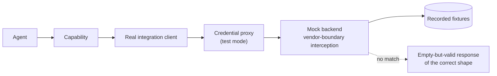

# Plan — 027 Synthetic Scenario Harness

## Summary

Adopt Tracer's synthetic scenario corpus, fixture schemas, mock backends, and
verdict-artefact writer — the single most valuable asset in either upstream — and
generalise the runner so any integration can contribute a scenario with fixtures
alone.

## Technical context

| Aspect | Choice |
|---|---|
| Fixture format | Directory per scenario: `scenario.yml`, `alert.json`, evidence JSON, `answer.yml` |
| Schemas | TypedDict definitions with explicit validators producing file-and-field errors |
| Mock backends | HTTP-level interception at the vendor boundary, on the real client path |
| Runner | `pytest`-driven and CLI-driven, sharing one loader and executor |
| Determinism | Temperature zero and fixed seeds where the provider supports them; offline mode uses a recorded transcript |
| Verdict records | JSONL, one line per attempt, enabled by environment variable |

## Constitution check

| Article | Satisfaction |
|---|---|
| I | Verdict records make every scored outcome explainable (FR-019, SC-004) |
| II | Scenario answer keys assert loop bounds via `max_investigation_loops` |
| III | Scenarios exercise read capabilities; write scenarios assert the approval gate blocks |
| IV | Fixtures contain no real credentials; the recording procedure scrubs them |
| V | FR-012 — the runner uses the canonical runtime, never an adapter |
| VI | The suite runs on any provider; offline mode removes the provider entirely |
| VII | **This is the substrate Article VII depends on** |
| VIII | `tests/synthetic/` and `tests/harness/` are outside the package tiers |
| IX | Trajectory-action vocabulary is validated against the real capability catalogue |
| X | The suite runs entirely offline; nothing leaves the machine (SC-001, SC-006) |
| XI | No storage dependency for scenario execution |
| XII | **This feature is how Article XII's "report the scenario-suite delta" is possible** |
| XIII | Provenance headers; the corpus is adopted from Tracer with attribution |

**Violations:** none.

## Project structure

```
tests/harness/
├── loader.py             # scenario discovery and fixture loading
├── schemas.py            # TypedDicts + validators with file/field errors
├── vocabularies.py       # controlled vocabularies, validated against the catalogue
├── runner.py             # execute one scenario through the real pipeline
├── suite.py              # run a suite or filtered subset, N attempts
├── determinism.py        # provider configuration for reproducible runs
├── offline.py            # recorded model transcript replay
├── artifacts.py          # JSONL verdict records
└── backends/
    ├── base.py           # vendor-boundary interception
    ├── recording.py      # capture live responses into fixtures
    ├── kubernetes.py  aws.py  datadog.py  grafana.py  loki.py
    ├── elasticsearch.py  prometheus.py  postgres.py  github.py
    └── ...               # one per integration, extensible

tests/synthetic/
├── <suite>/<NNN-name>/
│   ├── scenario.yml
│   ├── alert.json
│   ├── <evidence>.json
│   └── answer.yml
```

## Fixture schemas

`scenario.yml`:

```yaml
schema_version: "1"
scenario_id: 004-liveness-probe-killing
base: 000-healthy              # optional inheritance
failure_mode: probe_misconfiguration
severity: critical
scenario_difficulty: 2
adversarial_signals:
  - healthy_replicas_present
  - benign_prior_event
available_evidence:
  - k8s_pods
  - k8s_events
  - k8s_pod_logs
  - datadog_logs
```

`answer.yml`:

```yaml
root_cause_category: configuration_error
required_keywords: [liveness, probe, restart]
forbidden_categories: [healthy, unknown, resource_exhaustion]
ruling_out_keywords: [no oom, memory within limit]
required_evidence_sources: [k8s_events, k8s_pod_logs]
optimal_trajectory: [list_pods, get_events, get_pod_logs]
golden_trajectory:
  ordered_actions: [list_pods, get_events, get_pod_logs]
  matching: lcs
  max_edit_distance: 1
  max_extra_actions: 2
  max_redundancy: 0
max_investigation_loops: 4
model_response: |
  ROOT_CAUSE: ...
```

`ruling_out_keywords` is the adversarial axis: it asserts the agent explicitly
dismissed the planted confounders rather than never considering them.

## Mock backend design (FR-007, FR-008)



Interception at the vendor boundary keeps the client, pagination, error mapping,
and proxy under test. FR-008's empty-but-valid fallback matters because an agent
exploring beyond a scenario's evidence should learn "nothing there", not "the tool
is broken" — the latter changes its behaviour in ways the answer key never
anticipated.

## Difficulty curriculum (FR-021)

| Level | Definition |
|---|---|
| 1 | A single obvious cause with corroborating evidence |
| 2 | One planted confounder that must be explicitly ruled out |
| 3 | Several plausible causes requiring evidence to discriminate |
| 4 | The most prominent signal is misleading; the true cause is secondary |

Reporting by level (SC-007) is what shows whether an improvement helped everywhere
or only on easy cases.

## Implementation phases

### Phase 1 — Schemas and loader (test-first)
Fixture schemas with file-and-field validators, controlled vocabularies validated
against the live catalogue, inheritance, malformed-fixture tests (SC-003).

### Phase 2 — Mock backends
Vendor-boundary interception base, empty-but-valid fallback, call recording, and
the tier-1 backend set.

### Phase 3 — Runner
Single-scenario execution through the canonical runtime and real pipeline, suite
execution with filtering and N attempts.

### Phase 4 — Determinism and offline
Deterministic provider configuration, transcript recording and replay for offline
mode, reproducibility verification (SC-002, SC-006).

### Phase 5 — Verdict records
JSONL artefacts with full scoring detail, enabled by environment variable,
failure-explainability validation (SC-004).

### Phase 6 — Corpus
Port Tracer's existing scenarios, verify each loads and runs, stratify by
difficulty, add the recording procedure for new fixtures.

### Phase 7 — Integration and CI
Per-integration scenario contribution path (SC-005), CI wiring with the offline
path on every pull request, time-budget validation (SC-008).

## Complexity tracking

| Item | Justification |
|---|---|
| Mocking at the vendor boundary rather than the capability | More work to build, and it is the only way integration-layer bugs stay visible. Capability-level mocking would make the suite green while the real client is broken. |
| Empty-but-valid fallback | Requires knowing every response shape. Prevents exploratory calls from producing errors that change agent behaviour and invalidate the answer key. |
| Offline transcript mode | Two execution paths to maintain. Buys a suite that can run on every pull request without token spend, which is what makes regression gating affordable. |
| Verdict records off by default | A small conditional. Keeps normal runs fast while making deep failure analysis available when needed. |

## Provenance

| Adopted from | Upstream path | Disposition |
|---|---|---|
| Tracer | `tests/synthetic/schemas.py`, `k8s_schemas.py` | ADOPT — fixture schemas and validators |
| Tracer | `tests/synthetic/{eks,rds_postgres,grafana,hermes,openclaw,...}` | ADOPT — the scenario corpus |
| Tracer | `tests/synthetic/mock_*_backend/` | ADOPT → `tests/harness/backends/` |
| Tracer | `tests/synthetic/score_artifacts.py` | ADOPT → `artifacts.py` |
| Tracer | `tests/synthetic/llm_provider_preflight.py` | ADAPT → `determinism.py` |
| Tracer | Scenario inheritance (`base:`) | ADOPT |
| Tracer | Difficulty and adversarial-signal metadata | ADOPT → the curriculum |
| Swapnil | otel-demo fault injection | REFERENCE → feature 029 |

## Risks

| Risk | Mitigation |
|---|---|
| Fixtures drift from real vendor responses | Documented recording procedure (FR-011) plus feature 024's scheduled live contract runs, which detect shape changes independently |
| Scenarios become implementation tests rather than incident tests | Answer keys describe the incident; the trajectory-action vocabulary is validated against the catalogue so a rename is a load error rather than a silent scoring failure |
| Determinism is unattainable on some providers | Offline transcript mode gives full determinism where the provider cannot; SC-002 is asserted on a deterministic configuration |
| The corpus becomes too slow for CI | Tier-1 subset on every pull request with the offline path; full suite on a schedule (SC-008) |
| Coincidental keyword matches inflate scores | Keyword checks are combined with category, evidence, and trajectory axes in feature 028, so no single axis can pass a scenario alone |
