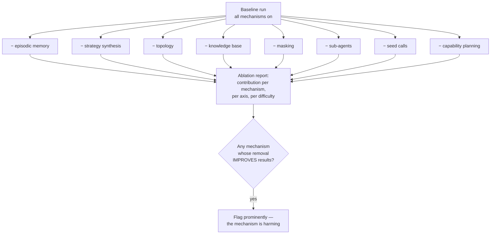

# Plan — 028 Evaluation and Ablation

## Summary

Build the multi-axis scorer, the golden-trajectory comparator, the ablation
harness, and the CI regression gate on top of feature 027's runner. The ablation
harness is new work — neither upstream has one — and it is what makes Constitution
Article VII enforceable rather than aspirational.

## Technical context

| Aspect | Choice |
|---|---|
| Scoring | Five independent axis scorers over a scenario run and its answer key |
| Trajectory | Sequence comparison with strict, LCS, and set modes; parallel batches as unordered sets |
| Ablation | Declarative configuration toggling documented switches on the mechanisms |
| Variance | N attempts per scenario, mean and standard deviation reported |
| Gating | Tolerance policy accounting for variance; separate correctness and cost gates |
| Baselines | Stored suite results, referenceable by identifier |
| Benchmarks | Adapter port with Cloud-OpsBench as the reference |

## Constitution check

| Article | Satisfaction |
|---|---|
| I | The evidence axis (FR-003) directly enforces "every claim names its evidence" |
| II | The trajectory axis enforces loop bounds; the cost axis makes budget effects visible |
| III | Write-capability scenarios assert the approval gate blocks execution |
| IV | Masking is an ablation axis, so its quality cost is measured rather than assumed |
| V | FR-024, SC-007 — benchmarks only from the canonical runtime |
| VI | FR-023 — cross-model comparison across all nine providers |
| VII | **This is the feature that makes Article VII real.** FR-012 to FR-016 |
| VIII | `tests/harness/` sits outside the package tiers |
| IX | Trajectory scoring depends on capabilities being named, typed actions |
| X | Evaluation runs entirely on the operator's machine |
| XI | Baselines and results stored as files, no database dependency |
| XII | **This feature is how "report the scenario-suite delta" becomes possible** |
| XIII | Provenance headers |

**Violations:** none.

## Project structure

```
tests/harness/scoring/
├── axes/
│   ├── accuracy.py        # category, required and forbidden keywords
│   ├── evidence.py        # required sources, claim backing
│   ├── adversarial.py     # ruling-out keywords
│   ├── trajectory.py      # golden comparison, extra, redundant, loops
│   └── cost.py            # tokens, wall clock
├── composite.py           # ScenarioScore assembly, partial reporting
├── matching.py            # strict / lcs / set, parallel-batch handling
└── report.py              # SuiteResult with variance

tests/harness/ablation/
├── config.py              # declarative AblationConfig
├── switches.py            # the documented mechanism switches
├── runner.py              # baseline plus one run per ablation
└── report.py              # contribution per mechanism, axis, difficulty

tests/harness/regression/
├── baseline.py            # store and reference
├── compare.py             # per-scenario, per-axis delta
├── gate.py                # variance-aware tolerance policy
└── ci.py                  # CI entry point

tests/benchmarks/
├── adapter.py             # external benchmark port
├── cloudopsbench/         # reference implementation
├── models/                # cross-model comparison
└── export.py              # README and release-note output
```

## The five axes

| Axis | Passes when | Detail reported |
|---|---|---|
| **Accuracy** | Category matches (or equivalent); all required keywords present; no forbidden category; no forbidden keyword | Which keywords were missing; which forbidden category matched |
| **Evidence** | All required sources collected; every validated claim references a real entry | Which sources were missing; which claims were unbacked |
| **Adversarial** | All ruling-out keywords present | Which confounders were not explicitly dismissed |
| **Trajectory** | Distance within `max_edit_distance`; extra and redundant calls within limits; loops within `max_investigation_loops` | The actual sequence, the diff, the counts |
| **Cost** | Tokens and wall clock within the configured budget | Actual versus budget |

A scenario passes only when every configured axis passes (FR-007), but all five
results are always reported — a scenario that fails on trajectory alone tells a
very different story from one that fails on accuracy.

## Trajectory matching (FR-008 to FR-011)

```
golden:  [list_pods, get_events, get_pod_logs]
actual:  [list_pods, get_metrics, get_events, get_pod_logs]

strict → fail (order differs)
lcs    → distance 1 (one insertion); passes if max_edit_distance >= 1
set    → passes (all golden actions present)

extra_actions   = 1   (get_metrics)
redundant_calls = 0   (no repeats)
loops           = 4   (against max_investigation_loops)
```

Parallel batches are compared as unordered sets within their position (FR-009),
because the runtime may schedule them in any order.

FR-011 matters: an agent that reaches the correct root cause via
`[get_events, get_pod_logs]` — skipping `list_pods` — is not wrong. It is a
trajectory deviation worth seeing, and the accuracy axis still passes.

## Ablation (FR-012 to FR-016)



Each mechanism exposes a documented switch (features 008, 010, 011, 012, and the
runtime). SC-004 verifies that toggling one changes nothing else, by comparing
traces.

## Regression gating (FR-017 to FR-021)

| Gate | Behaviour |
|---|---|
| Correctness | Fails when accuracy, evidence, or adversarial pass rate drops beyond tolerance, accounting for variance |
| Trajectory | Fails when median trajectory distance or loop count rises beyond tolerance |
| Cost | Separate gate; a cost rise with unchanged correctness fails the cost gate only |
| Variance | Gating uses mean over N attempts with the standard deviation considered, so noise does not fail builds |

Baselines are stored artefacts referenced by identifier (FR-021), so "compared to
what?" always has an answer.

## Implementation phases

### Phase 1 — Axis scorers (test-first)
Five scorers with fixtures asserting each axis fails independently for the right
reason.

### Phase 2 — Trajectory matching
Three modes, parallel-batch handling, extra and redundant counting, the
different-route deviation path (SC-009).

### Phase 3 — Composite and reporting
Scenario score assembly with partial reporting, suite aggregation with variance.

### Phase 4 — Ablation
Declarative configuration, mechanism switches wired to features 008–012 and the
runtime, baseline-plus-N runner, contribution report with the harm flag.

### Phase 5 — Regression gating
Baseline storage, delta comparison, variance-aware tolerance policy, separate cost
gate, CI entry point.

### Phase 6 — Benchmarks
External adapter port, Cloud-OpsBench implementation, cross-model comparison,
canonical-runtime guard, export for README and release notes.

### Phase 7 — Proof
Run the full ablation, produce the report, validate every success criterion, and
publish the first quantified learning claim.

## Complexity tracking

| Item | Justification |
|---|---|
| Five axes rather than pass/fail | They fail independently and mean different things. Collapsing them destroys the diagnostic value that makes the suite useful during development rather than only at release. |
| An ablation harness | Neither upstream has one, and it is the single mechanism that turns Article VII from a slogan into a constraint. It is also what lets a harmful mechanism be discovered rather than defended. |
| Variance-aware gating | Simple threshold gating on a stochastic system produces flaky builds, which get ignored, which makes the gate worthless. N attempts with variance is the minimum that makes gating trustworthy. |
| Separate cost gating | A change that improves accuracy at triple the cost is a real trade-off someone should decide on, not a silent pass. |

## Provenance

| Adopted from | Upstream path | Disposition |
|---|---|---|
| Tracer | `answer.yml` schema: `golden_trajectory`, `ruling_out_keywords`, `forbidden_categories`, `required_evidence_sources` | ADOPT — the schema exists upstream; a general scorer does not |
| Tracer | `tests/synthetic/score_artifacts.py` | ADOPT (via feature 027) |
| Tracer | `tests/benchmarks/cloudopsbench/` | ADAPT → `benchmarks/cloudopsbench/` |
| Tracer | `tests/benchmarks/toolcall_model_benchmark/` | ADAPT → `benchmarks/models/` |
| Tracer | `make benchmark`, `benchmark-update-readme` | ADAPT → `export.py` |
| Swapnil | `scripts/{eval_agent_performance,run_agent_eval,run_eval_validation}.py` | ADAPT → suite reporting |
| Swapnil | `scripts/fault_analysis.py` | ADAPT → failure-mode analysis in reports |
| — | Ablation harness | **NEW** — no upstream equivalent; required by Article VII |

## Risks

| Risk | Mitigation |
|---|---|
| Ablation shows a mechanism is harmful late in development | That is the mechanism working. The switch already exists, so the response is a configuration default change plus investigation, not a rewrite |
| Gating becomes flaky and gets disabled | Variance-aware tolerance (SC-005) validated by running an unchanged codebase N times before the gate is enabled |
| Scoring axes are gamed by prompt tuning | Axes are independent and adversarial resistance is separate from accuracy; passing by keyword stuffing fails the evidence and trajectory axes |
| Ablation runs multiply CI cost | Full ablation runs before a release and on a schedule, not on every pull request; the pull-request gate uses the offline path from feature 027 |
| Fixture changes look like agent regressions | Baselines record the corpus version; a corpus change requires a new baseline, making the distinction explicit |
