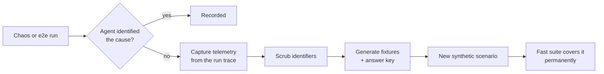

# Plan — 029 Chaos and End-to-End Suites

## Summary

Adopt Tracer's chaos experiment catalogue and cloud e2e scenarios, and Swapnil's
otel-demo with flagd fault injection. Score all of them on feature 028's axes, and
build the capture procedure that turns a real failure the agent missed into a
permanent synthetic scenario.

## Technical context

| Aspect | Choice |
|---|---|
| Chaos framework | Chaos Mesh, declarative experiment manifests |
| Demo application | OpenTelemetry demo with its bundled observability stack |
| Fault injection | flagd feature flags for demo faults; Chaos Mesh for infrastructure faults |
| Cluster options | Kind for local, EKS for cloud-backed |
| Cloud provisioning | Declarative infrastructure with tag-based lifecycle |
| Cleanup | Deferred teardown plus a tag-sweep reaper for orphans |
| Concurrency | Cluster lock preventing simultaneous suite runs |
| Scoring | Feature 028's axes, unchanged |

## Constitution check

| Article | Satisfaction |
|---|---|
| I | Real runs produce full traces; a missed cause becomes a captured scenario |
| II | Runs are bounded by the same guardrails as any investigation |
| III | Chaos injects faults; the agent investigates read-only. Remediation scenarios assert the approval gate blocks |
| IV | FR-022 — captured telemetry is scrubbed before commit |
| V | Runs use the canonical runtime |
| VI | Suites run on any provider |
| VII | Real-world results validate that synthetic-suite improvements transfer |
| VIII | `tests/chaos/` and `tests/e2e/` sit outside the package tiers |
| IX | Real integrations exercised end to end |
| X | Runs against the operator's own cluster; nothing external |
| XI | No production storage dependency |
| XII | Experiments declare expected symptom and cause before the run |
| XIII | Provenance headers |

**Violations:** none.

## Project structure

```
tests/chaos/
├── framework/
│   ├── injector.py        # Chaos Mesh manifest application
│   ├── preflight.py       # cluster health before injection
│   ├── validity.py        # did the experiment produce its symptom?
│   ├── cleanup.py         # deferred teardown, verified return to baseline
│   └── lock.py            # cluster-level concurrency lock
├── experiments/
│   ├── pod-kill/          container-kill/     cpu-stress/
│   ├── memory-stress/     io-latency/         network-delay/
│   ├── network-partition/ network-corrupt/    bandwidth-limit/
│   ├── dns-error/         dns-random/         http-abort/
│   ├── http-delay/        http-response-fault/
│   └── (each: chaos.yaml, alert.json, expected.yml)
└── runner.py

tests/e2e/
├── otel_demo/
│   ├── install.py         # demo + observability stack
│   ├── faults/            # cart, product, recommendation, ad, payment
│   └── runner.py
├── cloud/
│   ├── provisioning/      # declarative, tag-based lifecycle
│   ├── scenarios/         # eks, ec2, cloudwatch, lambda, ecs, rds
│   ├── reaper.py          # tag-sweep orphan cleanup
│   └── cost.py            # per-run bound and reporting
└── capture.py             # real failure → synthetic scenario

test-infra/
├── kind/                  # local cluster
└── eks/                   # cloud cluster
```

## Chaos experiment structure

Each experiment declares what it expects, before it runs:

```yaml
# tests/chaos/experiments/dns-error/expected.yml
experiment_id: dns-error
injected_fault: dns_resolution_failure
expected_symptom:
  - service_unreachable
  - connection_timeout_errors
expected_root_cause_category: network_failure
required_keywords: [dns, resolution, name]
validity_probe:
  # how we confirm the fault actually took effect before scoring the agent
  check: dns_lookup_fails_from_pod
  timeout_seconds: 60
```

The `validity_probe` (FR-006, SC-005) is what separates "the agent was wrong" from
"the experiment did not work" — without it, a flaky injection looks like an agent
regression.

## The feedback loop (FR-017)



This is the point of running expensive suites: every miss becomes a cheap,
permanent regression test.

## Cost and lifecycle control

| Control | Mechanism |
|---|---|
| Provisioning | Declarative, every resource tagged with the run identifier |
| Teardown | Deferred, runs on success, failure, and interruption |
| Orphan reaping | Tag sweep on a schedule, independent of any run |
| Bound | Declared per scenario, actual reported (FR-015) |
| Concurrency | Cluster lock; a second run waits or skips (FR-020) |

## Implementation phases

### Phase 1 — Framework (test-first)
Injector, preflight, validity probe, cleanup with interruption handling, cluster
lock. Cleanup-on-interruption test (SC-002) written first.

### Phase 2 — Chaos experiments
The fourteen experiments with manifests, alerts, and expectation files.

### Phase 3 — otel-demo
Installation, the five feature-flag faults, runner, integration with real
observability integrations.

### Phase 4 — Cloud e2e
Declarative provisioning with tagging, the six managed-service scenarios,
teardown, tag-sweep reaper, cost bounding and reporting.

### Phase 5 — Scoring integration
Feature 028 axes applied to real runs, validity gating so invalid experiments are
not scored as agent failures, cross-release comparability.

### Phase 6 — Capture procedure
Telemetry capture from a run trace, identifier scrubbing, fixture and answer-key
generation, validated by converting a real miss (SC-006).

### Phase 7 — Operability
One-command setup and teardown, clean skipping without infrastructure, scheduled
CI wiring, documentation.

## Complexity tracking

| Item | Justification |
|---|---|
| Real infrastructure suites at all | Synthetic fixtures cannot contain failure modes nobody thought to record. The chaos suite's job is finding what the fast suite does not know to test. |
| Validity probes per experiment | Without them, a flaky injection is indistinguishable from an agent regression, and the suite's signal becomes noise nobody trusts. |
| Cleanup on interruption plus a tag reaper | Leaked cloud resources are both a cost and a security problem. Two independent mechanisms because teardown itself can fail. |
| The capture procedure | The most valuable output of an expensive suite is a cheap permanent test. Without capture, each expensive finding is discovered again next release. |

## Provenance

| Adopted from | Upstream path | Disposition |
|---|---|---|
| Tracer | `tests/chaos_engineering/experiments/` | ADOPT — container-kill, crashloop, dns-error, dns-random, http-abort, io-latency, network-bandwidth, network-corrupt, network-delay and others |
| Tracer | `tests/chaos_engineering/cli.py` | ADAPT → `tests/chaos/runner.py` |
| Tracer | `tests/e2e/{kubernetes,cloudwatch_demo,upstream_lambda,upstream_apache_flink_ecs,upstream_prefect_ecs_fargate}` | ADAPT → `tests/e2e/cloud/` |
| Tracer | `tests/e2e/kubernetes/{helm,k8s_manifests,infrastructure_sdk}` | ADAPT → provisioning |
| Tracer | `tests/e2e/install/`, `quickstart/` | ADAPT → operability checks |
| Swapnil | `test-infra/{eks,kind}/` | ADOPT |
| Swapnil | otel-demo installation and flagd fault injection | ADOPT → `tests/e2e/otel_demo/` |
| Swapnil | `scripts/e2e_test_otel_demo.py`, `e2e_test_all.sh` | ADAPT |
| Swapnil | `make e2e-*` targets | ADAPT |

## Risks

| Risk | Mitigation |
|---|---|
| Leaked cloud resources accumulate cost | Deferred teardown plus an independent tag-sweep reaper (FR-014, SC-004) |
| Flaky injections produce false agent regressions | Validity probes gate scoring (FR-006, SC-005) |
| Suites are too slow or expensive to run regularly | Scheduled and pre-release only; the capture procedure moves findings into the fast suite so routine gating stays cheap |
| Real telemetry leaks identifiers into committed fixtures | Scrubbing in the capture procedure (FR-022), verified before commit |
| Concurrent runs corrupt each other | Cluster lock (FR-020) |
| A cluster already unhealthy invalidates a run | Preflight health check (FR-007) reports rather than scoring |
