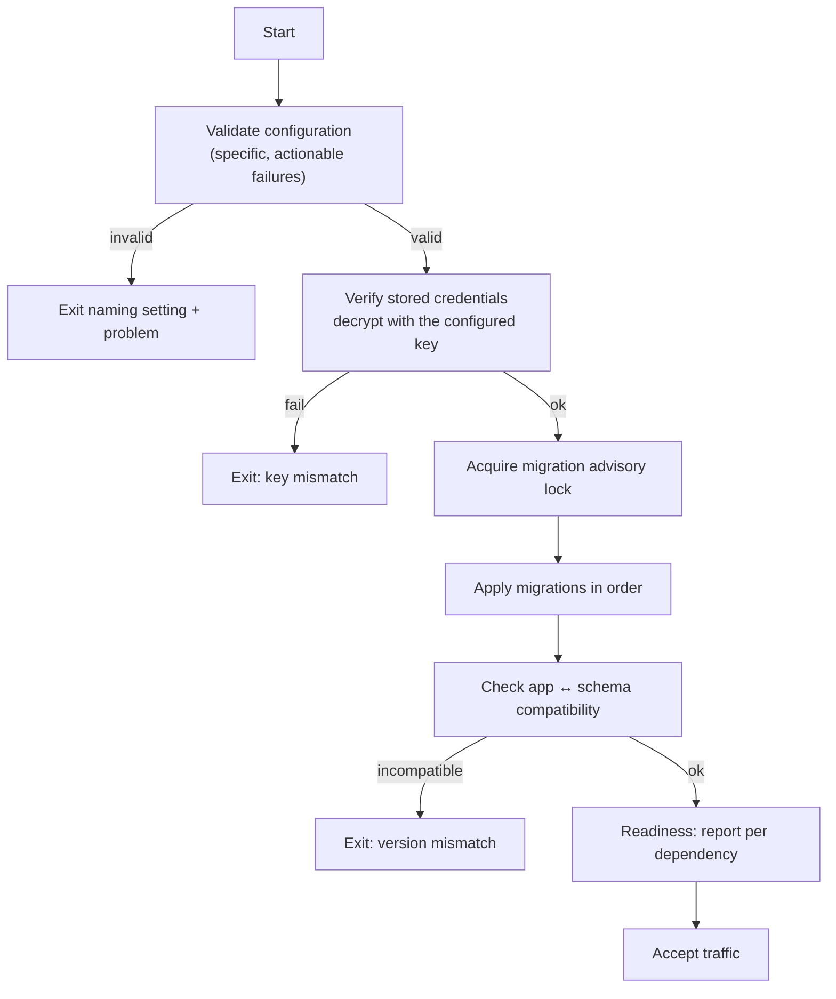

# Plan — 030 Deployment Profiles

## Summary

Package NinjaSRE for three deployment shapes with the operational machinery each
requires: locked automatic migrations, single-artefact backup and restore,
zero-downtime key rotation, air-gapped operation, and startup validation that fails
with actionable messages.

## Technical context

| Aspect | Choice |
|---|---|
| `dev` | Single application process plus Postgres; in-process proxy; `process` sandbox |
| `standard` | Docker Compose: app, console, Postgres, credential proxy |
| `enterprise` | Helm chart: app replicas, sandbox pods with Envoy, Postgres, OTel, SSO |
| Images | Multi-stage builds, minimal base, non-root, pinned digests |
| Migrations | Alembic under `pg_advisory_lock`, applied at startup |
| Backup | `pg_dump` covering relational, `pgvector`, and AGE data in one artefact |
| Keys | Operator-supplied; rotation re-encrypts in batches online |
| Air-gapped | Image bundle export plus a local model |

## Constitution check

| Article | Satisfaction |
|---|---|
| I | Traces and audit survive upgrades and are captured in backups |
| II | Concurrency, pool sizes, and replica defaults are profile-scoped named constants |
| III | Profile choice never weakens approval gating |
| IV | FR-019 to FR-022 — operator-supplied keys, early verification, online rotation |
| V | Every profile runs the canonical runtime |
| VI | FR-023 — air-gapped with a local model is a first-class profile |
| VII | Backups preserve the episode corpus so learning survives a restore |
| VIII | Deployment artefacts live in `deploy/`, outside the package tiers |
| IX | Capability catalogue is built into the image, not fetched at runtime |
| X | **Central.** FR-024, SC-008 — no unconfigured outbound connection |
| XI | One Postgres per deployment, backed up as one artefact |
| XII | Backup/restore, upgrade-skip, and misconfiguration tests are automated |
| XIII | Provenance headers on adapted deployment files |

**Violations:** none.

## Project structure

```
deploy/
├── compose/
│   ├── docker-compose.yml          # standard profile
│   ├── docker-compose.dev.yml      # dev profile
│   └── .env.example                # every setting documented
├── helm/
│   └── ninjasre/                   # enterprise chart
│       ├── templates/              # app, console, sandbox, proxy, migrations job
│       └── values.yaml
├── images/
│   ├── app.Dockerfile
│   ├── console.Dockerfile
│   ├── proxy.Dockerfile
│   ├── postgres.Dockerfile         # with pgvector and AGE pinned
│   └── bundle.sh                   # air-gapped image export
├── ops/
│   ├── backup.sh  restore.sh
│   ├── rotate_key.py
│   └── preflight.py                # startup configuration validation
└── templates/                      # golden configuration templates

platform/startup/
├── validation.py                   # actionable configuration checks
├── migrations.py                   # locked, ordered, version-checked
└── readiness.py                    # dependency-specific readiness
```

## Profile comparison

| | `dev` | `standard` | `enterprise` |
|---|---|---|---|
| Components | app + Postgres | app, console, Postgres, proxy | app replicas, console, sandbox pods, proxy, Postgres, OTel |
| Container count | 2 | **4** | Helm-managed |
| Credential proxy | in-process | container | deployment |
| Sandbox | `process` | `container` | `kubernetes` + Envoy |
| Identity | local admin | local admin or SSO | SSO |
| Scheduler | in-process | in-process | leader-claimed across replicas |
| Target | development | team self-hosting | regulated / multi-tenant |

SC-002 pins the `standard` count at four, because every additional stateful service
is an operational burden the operator did not ask for.

## Startup sequence



Key verification (FR-020) happens **before** migrations, so a wrong key fails in
seconds rather than after a schema change.

## Backup and restore

One artefact covering all three data shapes, since they share one database
(ADR 0004):

| Step | Action |
|---|---|
| Backup | `pg_dump` with extensions, producing one file plus a manifest recording version and extension versions |
| Verify | Restore into a scratch database and check relational, vector, and graph integrity |
| Restore | Version check against the manifest; migrate forward or refuse with a reason (FR-017) |
| Test | Automated backup-restore-verify cycle in CI (FR-018, SC-004) |

## Air-gapped operation (FR-023, SC-005)

1. `deploy/images/bundle.sh` exports all images as a single archive.
2. A local model (Ollama or vLLM) is configured as the provider.
3. Startup validation confirms no configuration implies an outbound dependency.
4. SC-008's network monitor verifies the claim during a full investigation.

## Implementation phases

### Phase 1 — Validation and startup (test-first)
Misconfiguration fixture set with expected messages (SC-006), key verification,
locked migrations, readiness reporting.

### Phase 2 — Images
Multi-stage builds, minimal non-root base, pinned Postgres with `pgvector` and AGE,
digest pinning.

### Phase 3 — Compose profiles
`dev` and `standard`, documented `.env.example`, one-provider-credential minimum
viable configuration.

### Phase 4 — Helm chart
Enterprise chart with replicas, sandbox pods and Envoy, migration job, OTel, SSO.

### Phase 5 — Backup, restore, upgrade
Single-artefact backup, verified restore, version-checked restore, skip-version
upgrade, documented and tested rollback.

### Phase 6 — Keys and air-gapped
Operator-supplied key handling, online rotation, key-loss documentation, image
bundling, local-model configuration.

### Phase 7 — Verification
Time-to-first-investigation measurement, container-count assertion, air-gapped
run, network monitoring, template application during setup.

## Complexity tracking

| Item | Justification |
|---|---|
| Three profiles | Requiring Kubernetes for development kills contribution; requiring Compose in a regulated environment kills adoption. Three profiles behind one configuration value cover both without a matrix. |
| Four containers in `standard` | ADR 0004's single datastore is what makes this possible. Every additional service is a backup strategy and an upgrade path the operator inherits. |
| Operator-supplied encryption key | Adds a setup step; prevents a silently-generated key ending up in an image layer and being discovered missing during a restore. |
| Air-gapped as a tested profile | Real work, and it is the deployment shape the target buyer most often needs. Untested air-gapped support is not support. |

## Provenance

| Adopted from | Upstream path | Disposition |
|---|---|---|
| Swapnil | `docker-compose.yml` topology | ADAPT → `deploy/compose/` |
| Swapnil | `sre-agent/Dockerfile`, `k8s/` manifests | ADAPT → images and Helm chart |
| Swapnil | `config_service/alembic/` startup migration | ADAPT → locked migration runner |
| Swapnil | `Makefile` dev targets | ADAPT |
| Swapnil | Admin-token-on-startup flow | ADOPT — a strong first-run experience |
| Swapnil | `config_service/golden_templates/` | ADOPT (via feature 013) → setup-time application |
| Tracer | `Dockerfile` | ADAPT |
| Tracer | `.env.example` documentation discipline | ADOPT |
| Tracer | `DEPLOYMENT.md` | ADAPT |
| Tracer | `platform/packaging/` | ADAPT |
| Tracer | AWS deployment automation, Cloudflare install proxy | REJECT — hosted-specific |

## Risks

| Risk | Mitigation |
|---|---|
| Fifteen-minute target proves unrealistic | SC-001 measures it on a clean machine; if it is missed, the setup flow is the thing that changes, not the target |
| A failed migration leaves an ambiguous state | FR-012 requires pre-migration state or a documented recoverable one; the skip-version test (SC-003) exercises the path |
| Key loss makes credentials unrecoverable | Documented consequence and procedure (FR-022); credentials are re-enterable, so recovery is possible if unpleasant |
| Air-gapped support silently breaks | SC-005 and SC-008 are automated: an air-gapped run plus network monitoring on every release |
| Corporate TLS interception breaks all outbound calls | Configurable trust settings (FR-025) with a documented setup path |
