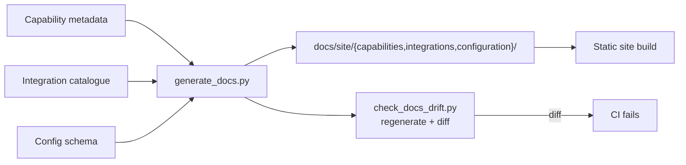

# Plan — 031 Observability and Documentation

## Summary

Instrument NinjaSRE with OpenTelemetry that exports nowhere unless the operator
says so, structure every log through the guardrail engine, and build a
documentation site whose reference sections are generated from the same metadata
the runtime uses — so they cannot drift.

## Technical context

| Aspect | Choice |
|---|---|
| Telemetry | OpenTelemetry SDK, OTLP export, disabled by default |
| Metrics | Bounded-cardinality instruments with an allow-listed label set |
| Tracing | Spans across pipeline stages, loop iterations, capabilities, sub-agents, storage |
| Logging | `structlog` with a fixed field set, guardrail-filtered at emission |
| Docs site | Static generator, buildable and servable offline |
| Generation | Capability, integration, and configuration references emitted from code metadata |
| Drift check | Regenerate in CI and fail on diff |
| Example testing | Documented code examples extracted and executed as tests |

## Constitution check

| Article | Satisfaction |
|---|---|
| I | Traces and structured logs are the operational evidence trail |
| II | Metric cardinality bounds and log rate limits are named constants |
| III | Approval latency is a first-class metric, so gating friction is measurable |
| IV | FR-013 — logs pass guardrails; the diagnostic bundle is redacted |
| V | Instrumentation lives at runtime boundaries, identical under any runtime |
| VI | Cost metrics are per model across all nine providers |
| VII | FR-022 — evaluation methodology documented reproducibly |
| VIII | `platform/observability/` tier 3; docs outside the tiers |
| IX | FR-016 — capability reference generated from metadata |
| X | **Central.** FR-001 to FR-003, SC-001, SC-008 |
| XI | Storage access is traced, not duplicated |
| XII | Drift check and example tests are automated |
| XIII | English documentation with i18n structure for community translation of guides |

**Violations:** none.

## Project structure

```
platform/observability/
├── config.py             # TelemetryConfig — disabled by default
├── tracing.py            # span creation and propagation
├── metrics/
│   ├── definitions.py    # instruments with bounded label sets
│   ├── cardinality.py    # label allow-list enforcement
│   └── cost.py           # per team, run, and model attribution
├── logging.py            # structlog configuration, guardrail filtering
├── export.py             # OTLP with failure isolation
└── diagnostics.py        # redacted diagnostic bundle

docs/site/
├── quickstart/           # executable end to end
├── deployment/           # the three profiles
├── configuration/        # GENERATED from the config schema
├── capabilities/         # GENERATED from capability metadata
├── integrations/         # GENERATED from the integration catalogue
├── security/             # threat model and controls
├── evaluation/           # reproducible methodology
├── contributing/
└── build/                # offline-capable static build

tools/
├── generate_docs.py      # capability, integration, configuration references
├── check_docs_drift.py   # regenerate and fail on diff
└── test_doc_examples.py  # extract and execute documented examples

deploy/dashboards/        # reference dashboard definitions
```

## Metric families (FR-006)

| Family | Instruments | Labels (bounded) |
|---|---|---|
| Investigation | count, duration, outcome | team, trigger, outcome |
| Cost | input tokens, output tokens, cached tokens, cost | team, model, provider |
| Capability | invocations, failures, duration | capability, outcome class |
| Integration | health, verification results | integration, status |
| Scheduler | queue depth, claim latency, misfires | — |
| Approval | pending count, decision latency, outcome | team, side-effect level |
| Guardrail | actions by type | rule, action |
| Memory | recall count, hit rate, episodes written | team |

Label sets are allow-listed (FR-005). A capability name is bounded by the
catalogue; a pod name is not, and never becomes a label.

## Cost attribution (FR-007, SC-009)

Cost accrues per model call and is attributed at three levels: run, team, and
model. A run that switches models mid-flight produces separate per-model records
that sum to the run total — which is why SC-009 tests exactly that case, since a
naive implementation attributes the whole run to whichever model was active at the
end.

## Documentation generation (FR-016, FR-017)



Hand-written sections — quickstart, deployment, security, evaluation, contributing
— are authored. Everything that describes what the code *is* is generated, because
that is the part that goes stale.

## Documentation sections

| Section | Nature | Why it exists |
|---|---|---|
| Quickstart | authored, executable | SC-006: a new operator succeeds using nothing else |
| Deployment | authored | The three profiles, upgrade, backup, keys, air-gapped |
| Configuration | **generated** | Every setting, from the schema |
| Capabilities | **generated** | Every capability with metadata, side-effect level, use cases |
| Integrations | **generated** | Every integration with credentials, permissions, limitations |
| Security | authored | The credential proxy, masking, guardrails, sandbox, approvals — each with the threat it addresses |
| Evaluation | authored | Reproducible methodology for the published numbers |
| Contributing | authored | Architecture, conventions, the seven-artefact integration anatomy |

## Implementation phases

### Phase 1 — Telemetry foundation (test-first)
Disabled-by-default assertion with network monitoring (SC-001), dependency scan
(SC-008), collector-outage isolation (SC-003).

### Phase 2 — Instrumentation
Metric definitions with cardinality bounds, tracing spans across all boundaries,
correlation propagation including sub-agent boundaries.

### Phase 3 — Cost and logging
Cost attribution per team, run, and model including mid-run switches; structured
logging with guardrail filtering and runtime-configurable levels.

### Phase 4 — Operational visibility
Reference dashboards, CLI and console cost reports, integration health surfacing,
diagnostic bundle.

### Phase 5 — Documentation generation
Capability, integration, and configuration reference generators; the drift check.

### Phase 6 — Authored documentation
Quickstart, deployment, security model, evaluation methodology, contributing guide;
example extraction and testing.

### Phase 7 — Verification
Offline build, new-operator quickstart validation, cardinality load test, full
success-criteria pass.

## Complexity tracking

| Item | Justification |
|---|---|
| Disabled-by-default telemetry | Costs some operator setup. It is what makes Article X observable rather than claimed, and it is what a security review checks first. |
| Bounded metric cardinality | Restricts what can be a label. An unbounded label — pod name, trace id — silently destroys a collector, and the operator blames the tool. |
| Generated reference documentation | A generator plus a drift check is more work than writing Markdown once. It is the only approach where the reference is still true two releases later. |
| Testing documented examples | Extraction machinery for a small number of examples. A quickstart with a broken command is worse than no quickstart. |

## Provenance

| Adopted from | Upstream path | Disposition |
|---|---|---|
| Tracer | `platform/observability/` | ADAPT — telemetry rebuilt as opt-in OTel only |
| Tracer | `platform/analytics/`, PostHog and Sentry integration | **REJECT** — ADR 0007 |
| Tracer | `core/agent_harness/accounting/` | ADAPT → `metrics/cost.py` (via feature 002) |
| Tracer | `docs/` structure and the docs-writing discipline | ADOPT — "test every sentence: does this change what the reader does?" |
| Tracer | `docs/DEVELOPMENT.md`, `CONTRIBUTING.md`, `SETUP.md` | ADAPT |
| Tracer | `AGENTS.md` conventions | ADAPT → contributing guide |
| Swapnil | `docs/ARCHITECTURE.md` | REFERENCE |
| Swapnil | `llms.txt` | ADOPT — machine-readable project summary |
| Swapnil | Health check scripts | ADAPT → `diagnostics.py` |

## Risks

| Risk | Mitigation |
|---|---|
| Instrumentation overhead affects investigation latency | Disabled by default; when enabled, sampling is configurable and export failures are isolated (FR-004) |
| Documentation drifts despite generation | The drift check runs in CI (SC-005); authored sections are covered by example testing (SC-007) |
| High-cardinality labels destroy a collector | Allow-listed label sets enforced at instrument creation (FR-005), load-tested (SC-004) |
| Quickstart works for the author and nobody else | SC-006 requires an operator who did not write it to complete it using only the quickstart |
| Evaluation methodology is documented but not reproducible | FR-022 requires third-party reproducibility; the methodology ships with the exact commands and baseline references |
